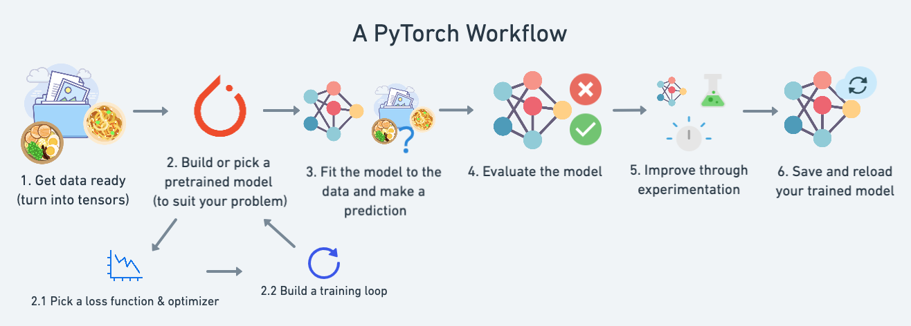
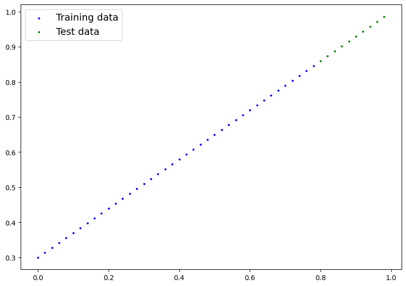
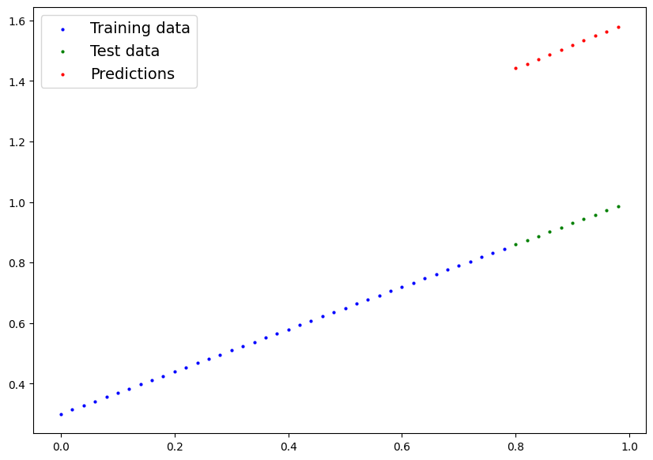
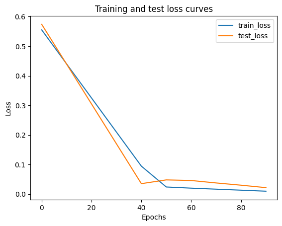
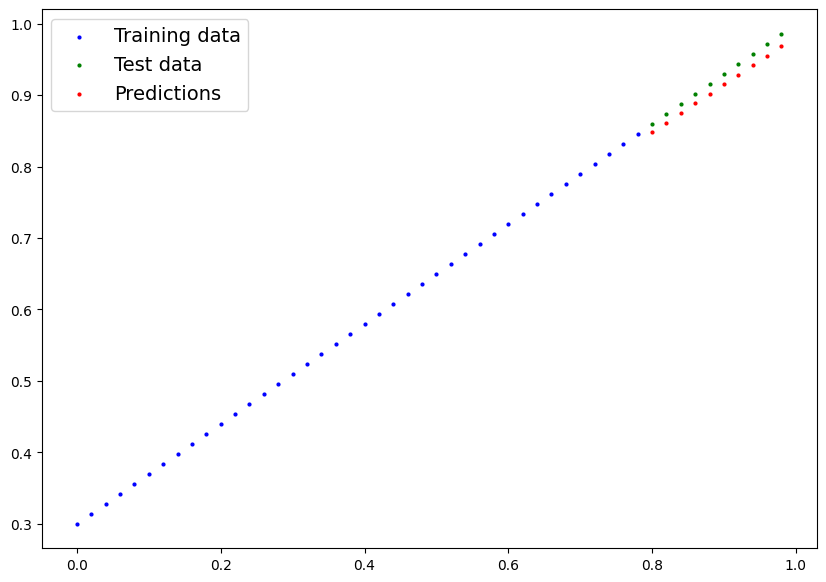

## 机器学习和深度学习
### 机器学习
机器学习是人工智能的一个子集，使系统能够在无需显式编程的情况下自主学习与优化。机器学习算法的工作原理是识别模式和数据，并在有新数据输入系统时进行预测。
机器学习中通常使用多种模型，包括：**监督学习**、**非监督学习**、**强化学习**等。

### 深度学习
深度学习是机器学习的一个子集，使用人工神经网络来处理和分析信息。神经网络由计算节点组成，这些节点分布于深度学习算法中的各层。每层都包含输入层、输出层和隐藏层。训练数据馈送至神经网络，以帮助算法学习并提高准确率。当神经网络除了输入层和输出层之外还包含多个隐藏层时，便被视为深度神经网络，而深度神经网络是深度学习的基础。

深度学习算法受人脑运作机制的启发，尤其擅长分析海量非结构化数据。它广泛应用于当今许多被认为属于 AI 的任务中，包括图像识别、语音识别、目标检测和自然语言处理。深度学习可以在数据集中建立复杂的非线性关联，但与机器学习相比，需要更多的训练数据和计算资源。

用于深度学习的一些常见类型的神经网络包括：

* 前馈神经网络 (FF)是一种最早的神经网络形式，其中数据单向流过人工神经元层，直到获得输出。
* 循环神经网络 (RNN) 是一种与前馈神经网络不同的神经网络，它们通常使用时序数据或涉及序列的数据。循环神经网络对前一层发生的事情具有“记忆”，这取决于当前层的输出。
* 长/短期记忆 (LSTM) 是一种高级形式的 RNN，能够利用记忆“记住”先前层的状态。
* 卷积神经网络 (CNN) 包含现代人工智能中一些最常见的神经网络，使用多个不同的层（先是卷积层，然后是池化层）过滤图片的不同部分，然后再将其全部放回（全连接层中）。
* 生成对抗网络 (GAN) 包含两个神经网络（生成器和判别器），它们在博弈过程中相互对抗，从而不断提升输出的准确率。

### 大模型（LLM）
LLM是当前深度学习在自然语言处理领域的集大成者。他是一种叫做Transformer的特殊深度学习神经网络架构。通过学习海量的文本数据，它本质上是一个极大规模的统计预测机器，
能够及其精准地预测上下文中的下一个词是什么，从而实现写文章、写代码、问答等生成式任务。


## PyTorch与深度学习
PyTorch是一个开源的机器学习和深度学习库，它允许使用Python代码来操作和处理数据以及编写机器学习算法。PyTorch已经成为深度学习研究者和开发者的首选框架。
PyTorch入门教程可参考官方文档：[入门教程](https://docs.pytorch.org/tutorials/beginner/basics/intro.html)

随着大模型的飞速发展，从chatgpt到如今的各种agent、vibe coding，AI已经切切实实的融入到各行各业中了，作为一个程序员，不仅工作学习中要融入各种AI工具，而且从本身懂编码的优势切入大模型相关的赛道，提高自身的竞争力，延长职业生涯。

因此从本文开始，我将介绍我转型AI赛道的学习历程。


## PyTorch神经网络入门
深度学习的本质是根据一些训练数据，构建算法模型（一般为神经网络）并训练算法模型，并使用训练好的模型来做预测。
我们先从最简单的神经网络模型（线性回归模型），来探究PyTorch模型训练推理的工作流。后续随着模型复杂度的提高，但Pytorch的基本工作流还会适用。

### Pytorch工作流

PyTorch工作流主要包含准备数据、根据解决问题种类建立模型、模型训练、模型预测和评估、改进模型、保存和加载使用训练好的模型。如下图所示：



接下来章节我们将使用PyTorch工作流构建我们第一个机器学习示例：线性回归模型。

## PyTorch构建第一个模型

### 数据准备
机器学习的数据类型是多种多样的，本文介绍的线性回归模型，我们使用数字即可。我们随机创建的数字要满足y=WX+ b，我们预先设定W和b，然后构建机器学习模型，看能否学习出W和b。
下面通过代码来展示。PyTorch的输入要求必须是Tensor。


```python
import torch

# 预设参数
weight = 0.7
bias = 0.3

# 构造X和y, 50个数据点
start = 0
end = 1
step = 0.02
X = torch.arange(start, end, step)
y = weight * X + bias
X,y
```


    (tensor([0.0000, 0.0200, 0.0400, 0.0600, 0.0800, 0.1000, 0.1200, 0.1400, 0.1600,
             0.1800, 0.2000, 0.2200, 0.2400, 0.2600, 0.2800, 0.3000, 0.3200, 0.3400,
             0.3600, 0.3800, 0.4000, 0.4200, 0.4400, 0.4600, 0.4800, 0.5000, 0.5200,
             0.5400, 0.5600, 0.5800, 0.6000, 0.6200, 0.6400, 0.6600, 0.6800, 0.7000,
             0.7200, 0.7400, 0.7600, 0.7800, 0.8000, 0.8200, 0.8400, 0.8600, 0.8800,
             0.9000, 0.9200, 0.9400, 0.9600, 0.9800]),
     tensor([0.3000, 0.3140, 0.3280, 0.3420, 0.3560, 0.3700, 0.3840, 0.3980, 0.4120,
             0.4260, 0.4400, 0.4540, 0.4680, 0.4820, 0.4960, 0.5100, 0.5240, 0.5380,
             0.5520, 0.5660, 0.5800, 0.5940, 0.6080, 0.6220, 0.6360, 0.6500, 0.6640,
             0.6780, 0.6920, 0.7060, 0.7200, 0.7340, 0.7480, 0.7620, 0.7760, 0.7900,
             0.8040, 0.8180, 0.8320, 0.8460, 0.8600, 0.8740, 0.8880, 0.9020, 0.9160,
             0.9300, 0.9440, 0.9580, 0.9720, 0.9860]))


#### 数据分割
对于机器学习的数据集来说，一个重要的步骤是要对数据进行训练集和测试集的划分，用于验证你的模型。有些数据量比较大的还会区分训练集、验证集及测试集。我们只区分训练集和测试集，训练集占比80%。


```python
# 数据集的划分
train_split = int(0.8 * len(X))
X_train, y_train = X[:train_split], y[:train_split]
X_test, y_test = X[train_split:], y[train_split:]
len(X_train), X_train.ndim, len(y_train), y_train.ndim,len(X_test), X_test.ndim, len(y_test), y_test.ndim
```


    (40, 1, 40, 1, 10, 1, 10, 1)


#### 数据可视化
机器学习过程中可视化是很重要的，能加深对模型的理解。


```python
import matplotlib.pyplot as plt
def plot_predictions(train_data=X_train,
                     train_labels=y_train,
                     test_data=X_test,
                     test_labels=y_test,
                     predictions=None):
    """
    绘制训练数据、测试数据和预测结果的函数
    """
    plt.figure(figsize=(10, 7))
    # 绘制训练数据，蓝色点
    plt.scatter(train_data, train_labels, c="b", s=4, label="Training data")
    # 绘制测试数据，绿色点
    plt.scatter(test_data, test_labels, c="g", s=4, label="Test data")
    # 如果有预测结果，绘制预测结果
    if predictions is not None:
        plt.scatter(test_data, predictions, c="r", s=4, label="Predictions")
    plt.legend(prop={"size": 14})
    plt.show()

plot_predictions()
```


    

    


### 建立模型
建立模型我们需要用到几个必须库，torch.nn 、torch.optim。torch.nn可以构建神经网络的每一层。optim可以指定参数优化算法，主要有梯度下降等。LinearRegressionModel就是我们的模型类，继承了nn.Module。我们神经网络就只有一个线性层，要是复杂的神经网络可以在__init__加入很多层神经网络。forward函数指明怎么对输入进行运算。有了模型，我们可以先查看模型相关的内容。


```python
from torch import nn
class LinearRegressionModel(nn.Module):
    def __init__(self):
        super().__init__()
        self.linear_layer = nn.Linear(in_features=1, out_features=1)

    def forward(self, x : torch.Tensor) -> torch.Tensor:
        return self.linear_layer(x)
```

#### 测试初始模型


```python

# 设置随机种子，随机初始化模型的权重
torch.manual_seed(42)

# 实例化模型
model_0 = LinearRegressionModel()
model_0, model_0.state_dict()

```


    (LinearRegressionModel(
       (linear_layer): Linear(in_features=1, out_features=1, bias=True)
     ),
     OrderedDict([('linear_layer.weight', tensor([[0.7645]])),
                  ('linear_layer.bias', tensor([0.8300]))]))


```python
# 将数据转换为二维张量
X_train = X_train.reshape(-1, 1)
X_test = X_test.reshape(-1, 1)
y_train = y_train.reshape(-1, 1)
y_test = y_test.reshape(-1, 1)

#对初始的模型进行预测
with torch.inference_mode():
    y_preds = model_0(X_test)

#可视化预测结果
plot_predictions(predictions=y_preds)
```


    

    


可以看到，当前模型针对测试集的预测结果还不理想，需要根据训练集对模型就行训练。

### 训练模型
为了在模型训练过程中能自动更新参数，我们需要添加损失函数和优化器。在模型训练中，损失函数（Loss Function）负责评估模型输出与真实值之间的差距，而优化器（Optimizer）则根据这一差距，通过微调模型参数来减小损失。两者配合构成了模型自我学习的核心闭环。PyTorch中损失函数可参考[官方文档](https://docs.pytorch.org/cppdocs/api/nn/loss.html)，根据不同的问题类型选择不同的损失函数。优化器的[官方文档](https://docs.pytorch.org/docs/2.12/optim.html#how-to-adjust-learning-rate)，可以学习的学习率等概念。


```python
# 设置损失函数
loss_fn = nn.L1Loss()

# 设置优化器，学习率为0.01
optimizer = torch.optim.SGD(model_0.parameters(), lr=0.01)
```

#### PyTorch的训练循环
| 序号 | 名称 | 内容 |
|:----| :----|:-----|
|1 |前向传播|模型会遍历所有训练数据一次，执行其 forward() 函数计算。|
|2 |计算损失|将模型的输出（预测）与真实情况进行比较，并评估其错误程度。|
|3 |清零梯度|优化器的梯度设置为零（默认情况下是累积的），以便针对特定的训练步骤重新计算它们。|
|4 |反向传播|计算损失函数相对于每个待更新模型参数的梯度，这被称为反向传播。|
|5 |更新权重|使用 requires_grad=True 更新损失梯度参数，以改进它们。|


```python
epoch_count = []
train_loss_values = []
test_loss_values = []

def train_loop(test_model):
    torch.manual_seed(42)

    # 模型训练的次数
    epochs = 100
    for epoch in range(epochs):
        test_model.train()

        # 前向传播
        y_pred = test_model(X_train)
        # 计算损失
        loss = loss_fn(y_pred, y_train)
        # 优化器梯度清零
        optimizer.zero_grad()
        # 反向传播
        loss.backward()
        # 更新权重
        optimizer.step()
        # 模型评估，切换到评估模式，想执行下面的代码就必须进入评估模式
        test_model.eval()

        # 每训练一次就评估一次模型在测试集上的表现
        with torch.inference_mode():
            test_pred = test_model(X_test)

            test_loss = loss_fn(test_pred, y_test.type(torch.float))

            if epoch % 10 == 0:
                epoch_count.append(epoch)
                train_loss_values.append(loss.detach().numpy())
                test_loss_values.append(test_loss.detach().numpy())
                print(f"Epoch:{epoch}, MAE train loss: {loss}, MAE test Loss:{test_loss}")

def print_loss_curves():
    plt.plot(epoch_count, train_loss_values, label="train_loss")
    plt.plot(epoch_count, test_loss_values, label="test_loss")
    plt.title("Training and test loss curves")
    plt.ylabel("Loss")
    plt.xlabel("Epochs")
    plt.legend()
    plt.show()

train_loop(model_0)
print_loss_curves()
```

    Epoch:0, MAE train loss: 0.5551779866218567, MAE test Loss:0.5739762187004089
    Epoch:10, MAE train loss: 0.4399680495262146, MAE test Loss:0.4392663538455963
    Epoch:20, MAE train loss: 0.3247582018375397, MAE test Loss:0.30455654859542847
    Epoch:30, MAE train loss: 0.20954832434654236, MAE test Loss:0.16984671354293823
    Epoch:40, MAE train loss: 0.09433844685554504, MAE test Loss:0.03513688966631889
    Epoch:50, MAE train loss: 0.023886388167738914, MAE test Loss:0.04784907028079033
    Epoch:60, MAE train loss: 0.019956793636083603, MAE test Loss:0.04580312967300415
    Epoch:70, MAE train loss: 0.016517985612154007, MAE test Loss:0.037530578672885895
    Epoch:80, MAE train loss: 0.013089167885482311, MAE test Loss:0.02994491532444954
    Epoch:90, MAE train loss: 0.009653175249695778, MAE test Loss:0.02167237363755703


    

    


从上图可看出，随着训练的推进，模型的损失越来越小。这时候我们可以在打印一下预测数据图。可以看到，模型预测的结果已经很接近我们生成数据的权重值了。


```python
model_0.state_dict()

with torch.inference_mode():
    y_pred = model_0(X_test)
plot_predictions(predictions=y_pred)
```


    

    


### 模型保存与加载
训练好的模型要存储起来用于别处推理，或者继续训练，Pytorch也提供了相关机制[官方文档](https://docs.pytorch.org/tutorials/beginner/saving_loading_models.html#saving-loading-model-for-inference)。


```python
# 保存模型到指定路径文件
torch.save(model_0.state_dict(), f="./model_linear.pth")

#加载模型
# 先创建一个模型的新实例
loaded_model_0 = LinearRegressionModel()

# 调用加载函数，这样就把之前训练好的模型参数加载到新创建的模型实例中了
loaded_model_0.load_state_dict(torch.load(f="./model_linear.pth"))
```


