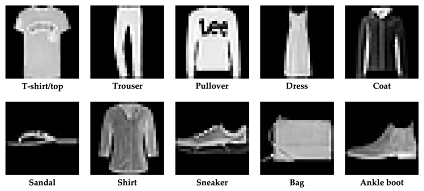
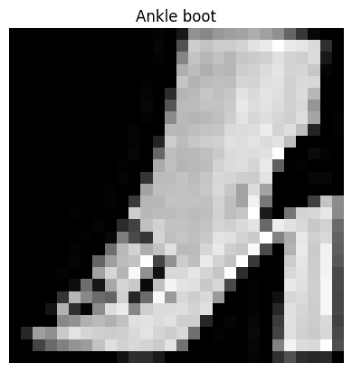
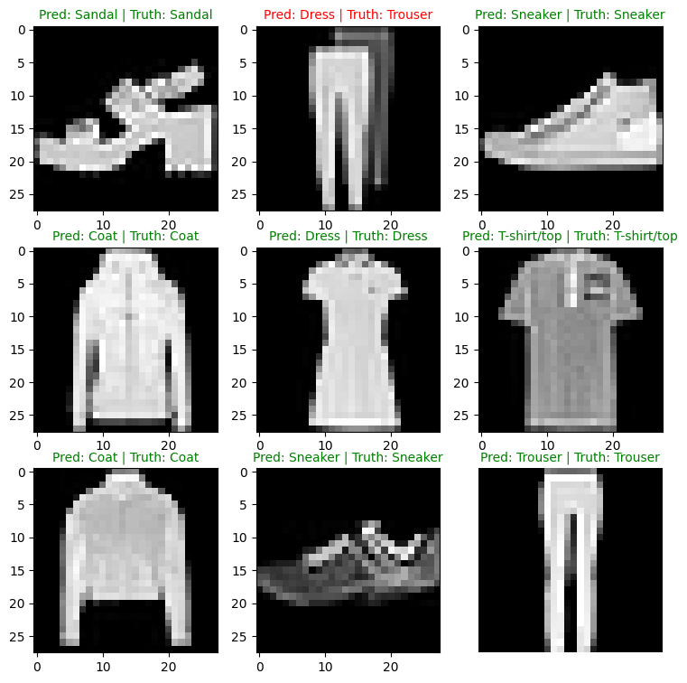
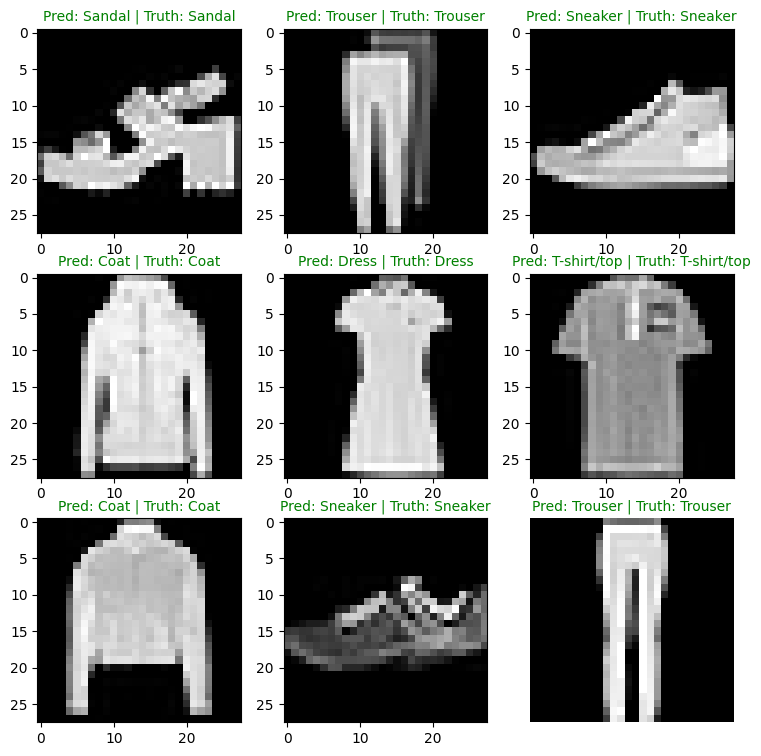

## 本文概要
计算机视觉（CV）也是人工智能的一个重要分支，本文将构建模型使用torchvision中的数据集处理经典图片分类问题[FashionMNIST](https://docs.pytorch.org/vision/stable/generated/torchvision.datasets.FashionMNIST.html)。

本文将继续使用[xx]()介绍的PyTorch工作流来处理图片分类问题。主要设计从torchvision库中加载数据及准备数据、线性模型和非线性模型及卷积模型处理CV问题的对比。

## PyTorch中的CV库
PyTorch中自带了许多计算机视觉相关的库和模型，具体介绍可参考[官网](https://docs.pytorch.org/vision/stable/index.html).
| PyTorch库| 功能简介 |
|:---|:---|
|torchvision|包含CV问题中的常见数据集、模型和图像变换|
|torchvision.datasets|提供许多CV数据集示例，包含图像分类、目标检测等问题，此外还提供了一系列用于穿件自定义数据集的类|
|torchvision.models|提供了用PyTorch实现的性能良好的CV模型|
|torchvision.transforms|主要用于图像在使用模型之前的转换（转为数字/处理/增强等）|
|torch.utils.data.Dataset|PyTorch的基础数据基类|
|torch.utils.data.DataLoader|创建一个基于数据集（使用torch.utils.data.Dataset）的Python可迭代对象|


## 使用PyTorch解决FashionMNIST问题
#### FashionMNIST介绍
FashionMNIST 是一个广泛用于测试机器学习算法的图像数据集，特别是在图像识别领域。它由 Zalando 发布，旨在替代传统的 MNIST 数据集，后者主要包含手写数字的图片。FashionMNIST 的设计初衷是提供一个稍微更具挑战性的问题，同时保持与原始 MNIST 数据集相同的图像大小（28x28 像素）和结构（训练集60,000张图片，测试集10,000张图片）。



FashionMNIST 包含来自 10 个类别的服装和鞋类商品的灰度图像。这些类别包括：
1. T恤/上衣（T-shirt/top）
2. 裤子（Trouser）
3. 套头衫（Pullover）
4. 裙子（Dress）
5. 外套（Coat）
6. 凉鞋（Sandal）
7. 衬衫（Shirt）
8. 运动鞋（Sneaker）
9. 包（Bag）
10. 短靴（Ankle boot）

每个类别都有相同数量的图像，使得这个数据集成为一个平衡的数据集。这些图像的简单性和标准化尺寸使得 FashionMNIST 成为计算机视觉和机器学习领域入门级的理想选择。数据集被广泛用于教育和研究，用于测试各种图像识别方法的效果。下面我们将按照PyTorch的工作流来一步一步的构建模型解决FashionMNIST分类问题。

### 加载数据集

为了解决FashionMNIST问题，根据上一篇文章中PyTorch工作流，我们要先准备数据。前面我们提到过，torchvision.datasets中包含了很多CV的示例数据集，其中就包括FashionMNIST。下面我们直接写代码去加载示例数据集。


```python
from torchvision import datasets
from torchvision.transforms import ToTensor
train_data = datasets.FashionMNIST(
    root="data",    #目录
    train=True,          #是否训练集
    download=True,       #是否下载到本地
    transform=ToTensor(), #转换为tensor，pytorch的模型只能处理tensor类型的输入
    target_transform=None)
test_data = datasets.FashionMNIST(
    root="data",
    train=False,
    download=True,
    transform=ToTensor())

```

    100%|██████████| 26.4M/26.4M [06:03<00:00, 72.6kB/s]
    100%|██████████| 29.5k/29.5k [00:00<00:00, 95.6kB/s]
    100%|██████████| 4.42M/4.42M [00:25<00:00, 172kB/s] 
    100%|██████████| 5.15k/5.15k [00:00<00:00, 3.36MB/s]


上述代码会把数据集下载到本地指定的目录。我们可以查看数据集的相关信息。


```python
# 查看第一个数据
image, label = train_data[0]
image, label, image.shape

```


    (tensor([[[0.0000, 0.0000, 0.0000, 0.0000, 0.0000, 0.0000, 0.0000, 0.0000,
               0.0000, 0.0000, 0.0000, 0.0000, 0.0000, 0.0000, 0.0000, 0.0000,
               0.0000, 0.0000, 0.0000, 0.0000, 0.0000, 0.0000, 0.0000, 0.0000,
               0.0000, 0.0000, 0.0000, 0.0000],
              [0.0000, 0.0000, 0.0000, 0.0000, 0.0000, 0.0000, 0.0000, 0.0000,
               0.0000, 0.0000, 0.0000, 0.0000, 0.0000, 0.0000, 0.0000, 0.0000,
               0.0000, 0.0000, 0.0000, 0.0000, 0.0000, 0.0000, 0.0000, 0.0000,
               0.0000, 0.0000, 0.0000, 0.0000],
              [0.0000, 0.0000, 0.0000, 0.0000, 0.0000, 0.0000, 0.0000, 0.0000,
               0.0000, 0.0000, 0.0000, 0.0000, 0.0000, 0.0000, 0.0000, 0.0000,
               0.0000, 0.0000, 0.0000, 0.0000, 0.0000, 0.0000, 0.0000, 0.0000,
               0.0000, 0.0000, 0.0000, 0.0000],
              [0.0000, 0.0000, 0.0000, 0.0000, 0.0000, 0.0000, 0.0000, 0.0000,
               0.0000, 0.0000, 0.0000, 0.0000, 0.0039, 0.0000, 0.0000, 0.0510,
               0.2863, 0.0000, 0.0000, 0.0039, 0.0157, 0.0000, 0.0000, 0.0000,
               0.0000, 0.0039, 0.0039, 0.0000],
              [0.0000, 0.0000, 0.0000, 0.0000, 0.0000, 0.0000, 0.0000, 0.0000,
               0.0000, 0.0000, 0.0000, 0.0000, 0.0118, 0.0000, 0.1412, 0.5333,
               0.4980, 0.2431, 0.2118, 0.0000, 0.0000, 0.0000, 0.0039, 0.0118,
               0.0157, 0.0000, 0.0000, 0.0118],
              [0.0000, 0.0000, 0.0000, 0.0000, 0.0000, 0.0000, 0.0000, 0.0000,
               0.0000, 0.0000, 0.0000, 0.0000, 0.0235, 0.0000, 0.4000, 0.8000,
               0.6902, 0.5255, 0.5647, 0.4824, 0.0902, 0.0000, 0.0000, 0.0000,
               0.0000, 0.0471, 0.0392, 0.0000],
              [0.0000, 0.0000, 0.0000, 0.0000, 0.0000, 0.0000, 0.0000, 0.0000,
               0.0000, 0.0000, 0.0000, 0.0000, 0.0000, 0.0000, 0.6078, 0.9255,
               0.8118, 0.6980, 0.4196, 0.6118, 0.6314, 0.4275, 0.2510, 0.0902,
               0.3020, 0.5098, 0.2824, 0.0588],
              [0.0000, 0.0000, 0.0000, 0.0000, 0.0000, 0.0000, 0.0000, 0.0000,
               0.0000, 0.0000, 0.0000, 0.0039, 0.0000, 0.2706, 0.8118, 0.8745,
               0.8549, 0.8471, 0.8471, 0.6392, 0.4980, 0.4745, 0.4784, 0.5725,
               0.5529, 0.3451, 0.6745, 0.2588],
              [0.0000, 0.0000, 0.0000, 0.0000, 0.0000, 0.0000, 0.0000, 0.0000,
               0.0000, 0.0039, 0.0039, 0.0039, 0.0000, 0.7843, 0.9098, 0.9098,
               0.9137, 0.8980, 0.8745, 0.8745, 0.8431, 0.8353, 0.6431, 0.4980,
               0.4824, 0.7686, 0.8980, 0.0000],
              [0.0000, 0.0000, 0.0000, 0.0000, 0.0000, 0.0000, 0.0000, 0.0000,
               0.0000, 0.0000, 0.0000, 0.0000, 0.0000, 0.7176, 0.8824, 0.8471,
               0.8745, 0.8941, 0.9216, 0.8902, 0.8784, 0.8706, 0.8784, 0.8667,
               0.8745, 0.9608, 0.6784, 0.0000],
              [0.0000, 0.0000, 0.0000, 0.0000, 0.0000, 0.0000, 0.0000, 0.0000,
               0.0000, 0.0000, 0.0000, 0.0000, 0.0000, 0.7569, 0.8941, 0.8549,
               0.8353, 0.7765, 0.7059, 0.8314, 0.8235, 0.8275, 0.8353, 0.8745,
               0.8627, 0.9529, 0.7922, 0.0000],
              [0.0000, 0.0000, 0.0000, 0.0000, 0.0000, 0.0000, 0.0000, 0.0000,
               0.0000, 0.0039, 0.0118, 0.0000, 0.0471, 0.8588, 0.8627, 0.8314,
               0.8549, 0.7529, 0.6627, 0.8902, 0.8157, 0.8549, 0.8784, 0.8314,
               0.8863, 0.7725, 0.8196, 0.2039],
              [0.0000, 0.0000, 0.0000, 0.0000, 0.0000, 0.0000, 0.0000, 0.0000,
               0.0000, 0.0000, 0.0235, 0.0000, 0.3882, 0.9569, 0.8706, 0.8627,
               0.8549, 0.7961, 0.7765, 0.8667, 0.8431, 0.8353, 0.8706, 0.8627,
               0.9608, 0.4667, 0.6549, 0.2196],
              [0.0000, 0.0000, 0.0000, 0.0000, 0.0000, 0.0000, 0.0000, 0.0000,
               0.0000, 0.0157, 0.0000, 0.0000, 0.2157, 0.9255, 0.8941, 0.9020,
               0.8941, 0.9412, 0.9098, 0.8353, 0.8549, 0.8745, 0.9176, 0.8510,
               0.8510, 0.8196, 0.3608, 0.0000],
              [0.0000, 0.0000, 0.0039, 0.0157, 0.0235, 0.0275, 0.0078, 0.0000,
               0.0000, 0.0000, 0.0000, 0.0000, 0.9294, 0.8863, 0.8510, 0.8745,
               0.8706, 0.8588, 0.8706, 0.8667, 0.8471, 0.8745, 0.8980, 0.8431,
               0.8549, 1.0000, 0.3020, 0.0000],
              [0.0000, 0.0118, 0.0000, 0.0000, 0.0000, 0.0000, 0.0000, 0.0000,
               0.0000, 0.2431, 0.5686, 0.8000, 0.8941, 0.8118, 0.8353, 0.8667,
               0.8549, 0.8157, 0.8275, 0.8549, 0.8784, 0.8745, 0.8588, 0.8431,
               0.8784, 0.9569, 0.6235, 0.0000],
              [0.0000, 0.0000, 0.0000, 0.0000, 0.0706, 0.1725, 0.3216, 0.4196,
               0.7412, 0.8941, 0.8627, 0.8706, 0.8510, 0.8863, 0.7843, 0.8039,
               0.8275, 0.9020, 0.8784, 0.9176, 0.6902, 0.7373, 0.9804, 0.9725,
               0.9137, 0.9333, 0.8431, 0.0000],
              [0.0000, 0.2235, 0.7333, 0.8157, 0.8784, 0.8667, 0.8784, 0.8157,
               0.8000, 0.8392, 0.8157, 0.8196, 0.7843, 0.6235, 0.9608, 0.7569,
               0.8078, 0.8745, 1.0000, 1.0000, 0.8667, 0.9176, 0.8667, 0.8275,
               0.8627, 0.9098, 0.9647, 0.0000],
              [0.0118, 0.7922, 0.8941, 0.8784, 0.8667, 0.8275, 0.8275, 0.8392,
               0.8039, 0.8039, 0.8039, 0.8627, 0.9412, 0.3137, 0.5882, 1.0000,
               0.8980, 0.8667, 0.7373, 0.6039, 0.7490, 0.8235, 0.8000, 0.8196,
               0.8706, 0.8941, 0.8824, 0.0000],
              [0.3843, 0.9137, 0.7765, 0.8235, 0.8706, 0.8980, 0.8980, 0.9176,
               0.9765, 0.8627, 0.7608, 0.8431, 0.8510, 0.9451, 0.2549, 0.2863,
               0.4157, 0.4588, 0.6588, 0.8588, 0.8667, 0.8431, 0.8510, 0.8745,
               0.8745, 0.8784, 0.8980, 0.1137],
              [0.2941, 0.8000, 0.8314, 0.8000, 0.7569, 0.8039, 0.8275, 0.8824,
               0.8471, 0.7255, 0.7725, 0.8078, 0.7765, 0.8353, 0.9412, 0.7647,
               0.8902, 0.9608, 0.9373, 0.8745, 0.8549, 0.8314, 0.8196, 0.8706,
               0.8627, 0.8667, 0.9020, 0.2627],
              [0.1882, 0.7961, 0.7176, 0.7608, 0.8353, 0.7725, 0.7255, 0.7451,
               0.7608, 0.7529, 0.7922, 0.8392, 0.8588, 0.8667, 0.8627, 0.9255,
               0.8824, 0.8471, 0.7804, 0.8078, 0.7294, 0.7098, 0.6941, 0.6745,
               0.7098, 0.8039, 0.8078, 0.4510],
              [0.0000, 0.4784, 0.8588, 0.7569, 0.7020, 0.6706, 0.7176, 0.7686,
               0.8000, 0.8235, 0.8353, 0.8118, 0.8275, 0.8235, 0.7843, 0.7686,
               0.7608, 0.7490, 0.7647, 0.7490, 0.7765, 0.7529, 0.6902, 0.6118,
               0.6549, 0.6941, 0.8235, 0.3608],
              [0.0000, 0.0000, 0.2902, 0.7412, 0.8314, 0.7490, 0.6863, 0.6745,
               0.6863, 0.7098, 0.7255, 0.7373, 0.7412, 0.7373, 0.7569, 0.7765,
               0.8000, 0.8196, 0.8235, 0.8235, 0.8275, 0.7373, 0.7373, 0.7608,
               0.7529, 0.8471, 0.6667, 0.0000],
              [0.0078, 0.0000, 0.0000, 0.0000, 0.2588, 0.7843, 0.8706, 0.9294,
               0.9373, 0.9490, 0.9647, 0.9529, 0.9569, 0.8667, 0.8627, 0.7569,
               0.7490, 0.7020, 0.7137, 0.7137, 0.7098, 0.6902, 0.6510, 0.6588,
               0.3882, 0.2275, 0.0000, 0.0000],
              [0.0000, 0.0000, 0.0000, 0.0000, 0.0000, 0.0000, 0.0000, 0.1569,
               0.2392, 0.1725, 0.2824, 0.1608, 0.1373, 0.0000, 0.0000, 0.0000,
               0.0000, 0.0000, 0.0000, 0.0000, 0.0000, 0.0000, 0.0000, 0.0000,
               0.0000, 0.0000, 0.0000, 0.0000],
              [0.0000, 0.0000, 0.0000, 0.0000, 0.0000, 0.0000, 0.0000, 0.0000,
               0.0000, 0.0000, 0.0000, 0.0000, 0.0000, 0.0000, 0.0000, 0.0000,
               0.0000, 0.0000, 0.0000, 0.0000, 0.0000, 0.0000, 0.0000, 0.0000,
               0.0000, 0.0000, 0.0000, 0.0000],
              [0.0000, 0.0000, 0.0000, 0.0000, 0.0000, 0.0000, 0.0000, 0.0000,
               0.0000, 0.0000, 0.0000, 0.0000, 0.0000, 0.0000, 0.0000, 0.0000,
               0.0000, 0.0000, 0.0000, 0.0000, 0.0000, 0.0000, 0.0000, 0.0000,
               0.0000, 0.0000, 0.0000, 0.0000]]]),
     9,
     torch.Size([1, 28, 28]))


```python
# 数据集的大小
len(train_data.data), len(train_data.targets), len(test_data.data), len(test_data.targets)
```


    (60000, 60000, 10000, 10000)


```python
# 分类的结果
train_data.classes
```


    ['T-shirt/top',
     'Trouser',
     'Pullover',
     'Dress',
     'Coat',
     'Sandal',
     'Shirt',
     'Sneaker',
     'Bag',
     'Ankle boot']


#### 使用DataLoader加载数据集
PyTorch 中，处理和加载数据是深度学习训练过程中的关键步骤。

为了高效地处理数据，PyTorch 提供了强大的工具，包括 torch.utils.data.Dataset 和 torch.utils.data.DataLoader，帮助我们管理数据集、批量加载和数据增强等任务。

PyTorch 数据处理与加载的介绍：

- 自定义 Dataset：通过继承 torch.utils.data.Dataset 来加载自己的数据集。
- DataLoader：DataLoader 按批次加载数据，支持多线程加载并进行数据打乱。
- 数据预处理与增强：使用 torchvision.transforms 进行常见的图像预处理和增强操作，提高模型的泛化能力。

DataLoader 是 PyTorch 提供的一个重要工具，用于从 Dataset 中按批次（batch）加载数据。

DataLoader 允许我们批量读取数据并进行多线程加载，从而提高训练效率。
##### 为什么要分批次加载数据
因为Batch处理可以减少每张图像的计算时间。
为啥可以减少呢？因为当你数据很多的时候，读取数据就会成为一个花费大量时间的事情，不如把更多的时间留在处理图片之上（一批批处理图像）。对于大多数机器学习问题来说，batch size设置为32是一个合适的选择。当然这是一个可设置的变量，可以尝试各种不同的值，不过一般最常用的是 2 的幂次（例如 32、64、128、256、512）。下面我们加载示例数据集。


```python
from torch.utils.data import DataLoader
BATCH_SIZE = 32

train_loader = DataLoader(train_data,batch_size = BATCH_SIZE, shuffle=True)
# shuffle=True表示每次迭代的时候都会打乱数据集的顺序，shuffle=False表示不打乱数据集的顺序。
test_loader = DataLoader(test_data,batch_size=BATCH_SIZE, shuffle=False)

# Let's check out what we've created
print(f"Dataloaders: {train_loader, test_loader}") 
print(f"Length of train dataloader: {len(train_loader)} batches of {BATCH_SIZE}")
print(f"Length of test dataloader: {len(test_loader)} batches of {BATCH_SIZE}")

# next(iter(train_loader))可以获取train_loader中的一个batch的数据，返回的是一个元组，包含两个元素，第一个元素是一个tensor，表示一个batch的特征数据，第二个元素是一个tensor，表示一个batch的标签数据。
train_features_batch, train_labels_batch = next(iter(train_loader))
train_features_batch.shape, train_labels_batch.shape
```

    Dataloaders: (<torch.utils.data.dataloader.DataLoader object at 0x11668d2d0>, <torch.utils.data.dataloader.DataLoader object at 0x11668faf0>)
    Length of train dataloader: 1875 batches of 32
    Length of test dataloader: 313 batches of 32


    (torch.Size([32, 1, 28, 28]), torch.Size([32]))


#### 可视化数据集
数据集都是图片，可视化就是把图片打印出来


```python
import matplotlib.pyplot as plt
# Show a sample
def show_sample():
    torch.manual_seed(42)
    random_idx = torch.randint(0, len(train_features_batch), size=[1]).item()
    img, label = train_features_batch[random_idx], train_labels_batch[random_idx]
    plt.imshow(img.squeeze(), cmap="gray")
    plt.title(train_data.classes[label])
    plt.axis("Off");
    print(f"Image size: {img.shape}")
    print(f"Label: {label}, label size: {label.shape}")
    plt.show()

show_sample()
```

    Image size: torch.Size([1, 28, 28])
    Label: 9, label size: torch.Size([])


    

    


## 构建模型
我们将构建线性模型、非线性模型和卷积模型对这个分类问题进行处理，并对各模型的性能进行对比分析。
### 线性模型


```python
from torch import nn
import torch
class FashionMnistModelV0(nn.Module):
    def __init__(self,input_shape : int, hidden_units : int, output_shape : int):
        super().__init__()
        self.layer_stack = nn.Sequential(nn.Flatten(),
                                           nn.Linear(in_features=input_shape, out_features=hidden_units),
                                           nn.Linear(in_features=hidden_units,out_features=output_shape))
    def forward(self, x : torch.Tensor):
        return self.layer_stack(x)

model_0 = FashionMnistModelV0(input_shape=784, hidden_units=10, output_shape=len(train_data.classes))
model_0.to("cpu")
model_0, model_0.state_dict()
```


    (FashionMnistModelV0(
       (layer_stack): Sequential(
         (0): Flatten(start_dim=1, end_dim=-1)
         (1): Linear(in_features=784, out_features=10, bias=True)
         (2): Linear(in_features=10, out_features=10, bias=True)
       )
     ),
     OrderedDict([('layer_stack.1.weight',
                   tensor([[ 0.0296, -0.0084,  0.0328,  ...,  0.0093,  0.0135, -0.0188],
                           [-0.0354,  0.0187,  0.0085,  ..., -0.0001,  0.0115, -0.0008],
                           [ 0.0017,  0.0045,  0.0133,  ..., -0.0188,  0.0059,  0.0100],
                           ...,
                           [ 0.0273, -0.0344,  0.0127,  ...,  0.0283, -0.0011, -0.0230],
                           [ 0.0257,  0.0291,  0.0243,  ..., -0.0087,  0.0001,  0.0176],
                           [-0.0147,  0.0053, -0.0194,  ..., -0.0221,  0.0205, -0.0093]])),
                  ('layer_stack.1.bias',
                   tensor([ 0.0283, -0.0033,  0.0255,  0.0017,  0.0037, -0.0302, -0.0123,  0.0018,
                            0.0163,  0.0069])),
                  ('layer_stack.2.weight',
                   tensor([[-0.0687,  0.0021,  0.2718,  0.2109,  0.1079, -0.2279, -0.1063,  0.2019,
                             0.2847, -0.1495],
                           [ 0.1344, -0.0740,  0.2006, -0.0475, -0.2514, -0.3130, -0.0118,  0.0932,
                            -0.1864,  0.2488],
                           [ 0.1500,  0.1907,  0.1457, -0.3050, -0.0580,  0.1643,  0.1565, -0.2877,
                            -0.1792,  0.2305],
                           [-0.2618,  0.2397, -0.0610,  0.0232,  0.1542,  0.0851, -0.2027,  0.1030,
                            -0.2715, -0.1596],
                           [-0.0555, -0.0633,  0.2302, -0.1726,  0.2654,  0.1473,  0.1029,  0.2252,
                            -0.2160, -0.2725],
                           [ 0.0118,  0.1559,  0.1596,  0.0132,  0.3024,  0.1124,  0.1366, -0.1533,
                             0.0965, -0.1184],
                           [-0.2555, -0.2057, -0.1909, -0.0477, -0.1324,  0.2905,  0.1307, -0.2629,
                             0.0133,  0.2727],
                           [-0.0127,  0.0513,  0.0863, -0.1043, -0.2047, -0.1185, -0.0825,  0.2488,
                            -0.2571,  0.0425],
                           [-0.1209, -0.0336, -0.0281, -0.1227,  0.0730,  0.0747, -0.1816,  0.1943,
                             0.2853, -0.1310],
                           [ 0.0645, -0.1171,  0.2168, -0.0245, -0.2820,  0.0736,  0.2621,  0.0012,
                            -0.0810, -0.0087]])),
                  ('layer_stack.2.bias',
                   tensor([ 0.1791,  0.2712, -0.0791,  0.1685,  0.1762,  0.2825,  0.2266, -0.2612,
                           -0.2613, -0.2624]))]))


### 非线性模型

与线性模型不同，非线性模型的关键在于引入了激活函数，从而让网络具备学习复杂模式的能力。这里我们使用的 `FashionMnistModelV1` 由两层线性层组成，中间插入了一个 ReLU 激活函数。

它的结构可以理解为：

1. `Flatten`：把输入图像从二维矩阵展开为一维向量，尺寸从 $28 \times 28$ 变成 $784$。
2. `Linear`：第一个全连接层把 $784$ 维特征映射到隐藏层。
3. `ReLU`：激活函数，给模型引入非线性能力，让它不仅仅是简单的线性变换。
4. `Linear`：第二个全连接层把隐藏层输出映射到 10 个分类结果。
5. `ReLU`：在输出前再一次引入非线性，帮助模型捕捉更复杂的特征关系。

ReLU（Rectified Linear Unit）是深度学习中最常见的激活函数之一，其公式为：

$$
\text{ReLU}(x) = \max(0, x)
$$

也就是说，当输入大于 0 时，直接输出原值；当输入小于 0 时，输出为 0。它的优点是计算简单、收敛速度快，并且在很多视觉任务中表现良好。相比于 Sigmoid 等激活函数，ReLU 能更有效地缓解梯度消失问题，因此在深度学习中被广泛使用。

通过在两层线性层之间加入 ReLU，模型就能够学习到比纯线性模型更复杂的映射关系，从而更适合处理 FashionMNIST 这类图像分类任务。


```python
class FashionMnistModelV1(nn.Module):
    def __init__(self,input_shape : int, hidden_units : int, output_shape : int):
        super().__init__()
        self.layer_stack = nn.Sequential(nn.Flatten(),
                                           nn.Linear(in_features=input_shape, out_features=hidden_units),
                                           nn.ReLU(),
                                           nn.Linear(in_features=hidden_units,out_features=output_shape),
                                           nn.ReLU())
    def forward(self, x : torch.Tensor):
        return self.layer_stack(x)
    
model_1 = FashionMnistModelV1(input_shape=784, hidden_units=10,output_shape=len(train_data.classes))
model_1.to("cpu")
model_1, model_1.state_dict()
```


    (FashionMnistModelV1(
       (layer_stack): Sequential(
         (0): Flatten(start_dim=1, end_dim=-1)
         (1): Linear(in_features=784, out_features=10, bias=True)
         (2): ReLU()
         (3): Linear(in_features=10, out_features=10, bias=True)
         (4): ReLU()
       )
     ),
     OrderedDict([('layer_stack.1.weight',
                   tensor([[ 0.0224, -0.0181,  0.0197,  ...,  0.0355, -0.0293, -0.0290],
                           [ 0.0062,  0.0239,  0.0236,  ...,  0.0102, -0.0129,  0.0235],
                           [ 0.0318,  0.0348, -0.0320,  ..., -0.0323, -0.0270, -0.0275],
                           ...,
                           [-0.0201,  0.0322, -0.0096,  ..., -0.0022,  0.0090,  0.0300],
                           [ 0.0132,  0.0252,  0.0189,  ...,  0.0141, -0.0189, -0.0134],
                           [ 0.0170, -0.0218,  0.0071,  ...,  0.0029, -0.0044,  0.0155]])),
                  ('layer_stack.1.bias',
                   tensor([-0.0296,  0.0081, -0.0277,  0.0282, -0.0141,  0.0073,  0.0024, -0.0142,
                           -0.0048,  0.0340])),
                  ('layer_stack.3.weight',
                   tensor([[-0.1599, -0.0822,  0.2084,  0.1857,  0.0875, -0.2767, -0.0510, -0.3116,
                            -0.1563, -0.0338],
                           [-0.1195,  0.1298,  0.0032,  0.0622,  0.0927,  0.0763, -0.3100,  0.0638,
                             0.2602,  0.1067],
                           [ 0.2270, -0.1712, -0.0803, -0.2885, -0.2888, -0.2384,  0.1616, -0.1860,
                             0.1061,  0.2190],
                           [ 0.1129, -0.1325,  0.2020,  0.1160,  0.0717, -0.0793,  0.2512,  0.1528,
                            -0.0556,  0.1458],
                           [-0.2107, -0.0274, -0.2625, -0.2822,  0.2576,  0.1681, -0.1073, -0.1762,
                            -0.1213, -0.0752],
                           [-0.0538,  0.2708,  0.3027,  0.1651, -0.1769, -0.1115,  0.0394, -0.1883,
                             0.2829, -0.1874],
                           [ 0.2927, -0.0014,  0.2865,  0.2067,  0.0284,  0.3104,  0.0276,  0.1214,
                            -0.0816, -0.2785],
                           [-0.1939, -0.2545,  0.2166,  0.1406,  0.0891,  0.2932, -0.2232,  0.0890,
                             0.0136, -0.2768],
                           [-0.3055,  0.3071,  0.2685,  0.0575, -0.2030,  0.0441,  0.2255, -0.0688,
                             0.0044, -0.1555],
                           [ 0.2390, -0.1927, -0.1777, -0.0812, -0.0100,  0.0797,  0.2461,  0.1937,
                             0.0456,  0.0829]])),
                  ('layer_stack.3.bias',
                   tensor([ 0.2681, -0.0929, -0.1505,  0.2422,  0.2743, -0.0130, -0.0124,  0.2400,
                           -0.0590,  0.3122]))]))


### 卷积模型

卷积神经网络（CNN）是计算机视觉领域最常用的模型之一。与前面的线性模型和非线性模型相比，卷积模型不仅能够处理图片中的像素信息，还能够自动学习局部特征，比如边缘、纹理和形状。

这里的 `FashionMnistModelV2` 主要由两部分组成：

1. 卷积块（Convolutional Blocks）
   - `Conv2d`：卷积层，用来从输入图像中提取局部特征。
   - `ReLU`：为卷积层输出引入非线性能力，增强模型表达能力。
   - `MaxPool2d`：池化层，用来下采样，减少特征图大小，降低计算成本，同时保留最重要的信息。

2. 分类头（Classifier）
   - `Flatten`：把卷积层提取到的二维特征图展开为一维向量。
   - `Linear`：把展开后的特征送入全连接层，进行最终分类。

卷积层是 CNN 的核心。它通过一个小的卷积核在输入图像上滑动，逐局部地提取特征。相比于普通全连接层，卷积层具有三个重要优势：

- 参数共享：同一个卷积核在整张图上共享权重，能显著减少参数量。
- 局部感知：每个卷积核只关注局部区域，更适合学习图像中的空间结构。
- 平移不变性：即使目标在图像中的位置发生轻微变化，模型也能更稳定地识别它。

在这里，第一层卷积层会先提取基础边缘和纹理特征，后续卷积层再进一步组合这些局部信息，形成更高层次的特征表示。最后通过分类层把这些特征映射到 10 个类别上，完成 FashionMNIST 的分类任务。


```python
class FashionMnistModelV2(nn.Module):
    def __init__(self, input_shape : int, hidden_units : int, output_shape : int):
        super().__init__()
        self.block1 = nn.Sequential(
            nn.Conv2d(in_channels=input_shape,
                      out_channels=hidden_units,
                      kernel_size=3,
                      stride=1,
                      padding=1),
            nn.ReLU(),
            nn.Conv2d(in_channels=hidden_units,
                      out_channels=hidden_units,
                      kernel_size=3,
                      stride=1,
                      padding=1),
            nn.ReLU(),
            nn.MaxPool2d(kernel_size=2,stride=2)
        )

        self.block2 = nn.Sequential(
            nn.Conv2d(hidden_units, hidden_units, 3,padding=1),
            nn.ReLU(),
            nn.Conv2d(hidden_units,hidden_units,3,padding=1),
            nn.ReLU(),
            nn.MaxPool2d(2)
        )
        self.classifier = nn.Sequential(
            nn.Flatten(),
            nn.Linear(in_features=hidden_units*7*7,out_features=output_shape)
        )
    def forward(self, x : torch.Tensor):
        x = self.block1(x)
        x = self.block2(x)
        return self.classifier(x)

model_2 = FashionMnistModelV2(input_shape=1, hidden_units=10, output_shape=len(train_data.classes))
model_2.to("cpu")
model_2, model_2.state_dict()
```


    (FashionMnistModelV2(
       (block1): Sequential(
         (0): Conv2d(1, 10, kernel_size=(3, 3), stride=(1, 1), padding=(1, 1))
         (1): ReLU()
         (2): Conv2d(10, 10, kernel_size=(3, 3), stride=(1, 1), padding=(1, 1))
         (3): ReLU()
         (4): MaxPool2d(kernel_size=2, stride=2, padding=0, dilation=1, ceil_mode=False)
       )
       (block2): Sequential(
         (0): Conv2d(10, 10, kernel_size=(3, 3), stride=(1, 1), padding=(1, 1))
         (1): ReLU()
         (2): Conv2d(10, 10, kernel_size=(3, 3), stride=(1, 1), padding=(1, 1))
         (3): ReLU()
         (4): MaxPool2d(kernel_size=2, stride=2, padding=0, dilation=1, ceil_mode=False)
       )
       (classifier): Sequential(
         (0): Flatten(start_dim=1, end_dim=-1)
         (1): Linear(in_features=490, out_features=10, bias=True)
       )
     ),
     OrderedDict([('block1.0.weight',
                   tensor([[[[-0.2442,  0.0819,  0.2525],
                             [-0.3209, -0.0882,  0.2841],
                             [ 0.2413, -0.2224,  0.2667]]],
                   
                   
                           [[[ 0.2856,  0.1310, -0.0845],
                             [-0.1915, -0.0688,  0.1050],
                             [ 0.0706,  0.0459, -0.2363]]],
                   
                   
                           [[[ 0.2702,  0.0393,  0.0689],
                             [-0.2772, -0.0939, -0.0805],
                             [ 0.2303,  0.2650, -0.2076]]],
                   
                   
                           [[[-0.2270, -0.1976, -0.0935],
                             [-0.2558,  0.3080, -0.2219],
                             [ 0.2747,  0.1354, -0.1223]]],
                   
                   
                           [[[-0.1643,  0.0335, -0.3268],
                             [-0.1420,  0.0438, -0.3215],
                             [ 0.3119, -0.1980, -0.0089]]],
                   
                   
                           [[[-0.1673, -0.1395, -0.1334],
                             [ 0.0663, -0.2050,  0.1375],
                             [ 0.1279,  0.1844, -0.3100]]],
                   
                   
                           [[[-0.1970,  0.2004,  0.2663],
                             [ 0.1248, -0.2884,  0.0817],
                             [ 0.2252, -0.0153,  0.2032]]],
                   
                   
                           [[[-0.2353,  0.1982,  0.0662],
                             [-0.1180,  0.2679, -0.3025],
                             [ 0.2859,  0.0757,  0.0913]]],
                   
                   
                           [[[-0.0367,  0.0428,  0.2347],
                             [ 0.0400,  0.0390,  0.1646],
                             [-0.1522, -0.0743,  0.1300]]],
                   
                   
                           [[[ 0.2963, -0.0613,  0.0087],
                             [ 0.1403, -0.2143, -0.2668],
                             [ 0.0193,  0.0594, -0.2575]]]])),
                  ('block1.0.bias',
                   tensor([ 0.3244,  0.1159, -0.2026,  0.2570,  0.0937,  0.0257,  0.0306, -0.2226,
                           -0.0268,  0.2590])),
                  ('block1.2.weight',
                   tensor([[[[-0.0525,  0.0489,  0.0669],
                             [ 0.1040, -0.0847,  0.0289],
                             [ 0.0347, -0.0357,  0.0621]],
                   
                            [[ 0.0408,  0.0896, -0.0754],
                             [ 0.0286, -0.0763,  0.0280],
                             [ 0.0673, -0.0899,  0.0817]],
                   
                            [[ 0.0604, -0.0096,  0.0975],
                             [ 0.0006, -0.0771, -0.0746],
                             [ 0.0683, -0.0866, -0.0354]],
                   
                            [[ 0.0847,  0.0542,  0.0963],
                             [ 0.0365,  0.0025,  0.0489],
                             [-0.0477,  0.0630, -0.0515]],
                   
                            [[-0.0333, -0.0294, -0.0576],
                             [-0.0021, -0.0227, -0.0199],
                             [ 0.0677,  0.0805, -0.0554]],
                   
                            [[ 0.1003,  0.0738, -0.0290],
                             [ 0.0753, -0.0346,  0.0979],
                             [-0.0056,  0.0796,  0.0860]],
                   
                            [[ 0.0725,  0.0413,  0.0149],
                             [-0.0844,  0.0012,  0.0658],
                             [ 0.1004,  0.0377, -0.0648]],
                   
                            [[-0.0020, -0.0439, -0.0008],
                             [-0.0675, -0.0100, -0.0008],
                             [ 0.0617, -0.0458, -0.0789]],
                   
                            [[-0.0052,  0.1014,  0.0489],
                             [ 0.0570, -0.1027, -0.0010],
                             [-0.0222,  0.0194,  0.0793]],
                   
                            [[ 0.0995,  0.0434,  0.0692],
                             [-0.0254, -0.0103, -0.0978],
                             [-0.0736, -0.0858,  0.0621]]],
                   
                   
                           [[[ 0.0508, -0.0852,  0.0841],
                             [-0.0995,  0.0106, -0.0957],
                             [ 0.0863, -0.0489, -0.0677]],
                   
                            [[ 0.0494, -0.0226,  0.0680],
                             [ 0.0984,  0.0749,  0.0131],
                             [-0.0088, -0.0755, -0.0617]],
                   
                            [[-0.0627,  0.0639,  0.0044],
                             [-0.0700,  0.0948, -0.0333],
                             [ 0.1035,  0.1003,  0.0182]],
                   
                            [[-0.0864,  0.0347,  0.0023],
                             [-0.0518, -0.0631, -0.0734],
                             [ 0.0163,  0.0440,  0.0178]],
                   
                            [[ 0.0610, -0.0385, -0.0380],
                             [ 0.1032, -0.0799, -0.0971],
                             [ 0.1026,  0.0653, -0.0176]],
                   
                            [[ 0.0322, -0.0332, -0.0146],
                             [ 0.0146, -0.0362,  0.0074],
                             [-0.0396, -0.0872,  0.0491]],
                   
                            [[-0.0773, -0.1030,  0.0209],
                             [ 0.0771,  0.0366, -0.0746],
                             [ 0.0635, -0.0305, -0.0130]],
                   
                            [[ 0.0628,  0.0414, -0.0372],
                             [ 0.0640, -0.0281, -0.0284],
                             [ 0.0727, -0.0238, -0.0021]],
                   
                            [[ 0.0986,  0.1014,  0.0248],
                             [ 0.0793, -0.0149, -0.0485],
                             [ 0.0986,  0.0553,  0.0721]],
                   
                            [[-0.0510,  0.0552,  0.0863],
                             [ 0.0101,  0.0703, -0.0956],
                             [ 0.0417, -0.0260,  0.0958]]],
                   
                   
                           [[[ 0.0380,  0.1044, -0.0366],
                             [ 0.0097,  0.0750, -0.0762],
                             [-0.0368, -0.0843, -0.0791]],
                   
                            [[ 0.0467, -0.0318,  0.0689],
                             [ 0.0097,  0.0371,  0.0112],
                             [-0.0988, -0.0159, -0.0579]],
                   
                            [[-0.0418,  0.0848, -0.0816],
                             [-0.0770, -0.0338, -0.0468],
                             [ 0.0260,  0.0676,  0.0165]],
                   
                            [[ 0.0019,  0.0506,  0.0629],
                             [ 0.0037, -0.0712, -0.0913],
                             [ 0.1052,  0.0343,  0.0965]],
                   
                            [[-0.0405,  0.0290, -0.0555],
                             [-0.0555, -0.0482,  0.1053],
                             [ 0.0769, -0.0649, -0.0744]],
                   
                            [[ 0.0348, -0.0249,  0.0050],
                             [ 0.0135, -0.0923,  0.0233],
                             [-0.0009, -0.0738, -0.1042]],
                   
                            [[ 0.0538, -0.0964, -0.0475],
                             [ 0.0641, -0.0702, -0.0499],
                             [-0.0664,  0.0620,  0.0326]],
                   
                            [[ 0.0109,  0.0371,  0.0302],
                             [-0.0223, -0.0097, -0.0660],
                             [-0.0495,  0.0016, -0.0128]],
                   
                            [[ 0.0265,  0.0500,  0.0809],
                             [ 0.1010, -0.0080,  0.0416],
                             [-0.0854,  0.0610, -0.0282]],
                   
                            [[-0.0836, -0.0821, -0.0879],
                             [-0.0487,  0.0481, -0.0860],
                             [-0.0124, -0.0164,  0.0388]]],
                   
                   
                           [[[-0.0430,  0.0534, -0.0652],
                             [ 0.0619, -0.1050, -0.0718],
                             [ 0.0370,  0.0162,  0.0738]],
                   
                            [[ 0.0549, -0.0878,  0.0829],
                             [-0.0274, -0.0199, -0.0449],
                             [-0.0183, -0.0984,  0.0081]],
                   
                            [[ 0.0794, -0.0211,  0.0811],
                             [-0.0476,  0.0426,  0.0104],
                             [-0.0409,  0.1028,  0.0087]],
                   
                            [[ 0.0047, -0.0114, -0.0057],
                             [ 0.0850, -0.0160,  0.0633],
                             [ 0.0382,  0.0687, -0.0799]],
                   
                            [[-0.0924, -0.0346, -0.0294],
                             [ 0.1004,  0.1039, -0.0251],
                             [-0.0505, -0.0004,  0.0403]],
                   
                            [[ 0.0360,  0.0199,  0.0774],
                             [ 0.0112,  0.0853,  0.0257],
                             [-0.0094,  0.0878,  0.0034]],
                   
                            [[ 0.0042, -0.0204,  0.0619],
                             [-0.0313,  0.0822,  0.0563],
                             [-0.0017, -0.0173,  0.0413]],
                   
                            [[-0.1029, -0.0349, -0.0373],
                             [-0.0129, -0.0504, -0.0455],
                             [ 0.0501, -0.0112, -0.0731]],
                   
                            [[-0.0076,  0.0340, -0.0427],
                             [ 0.0897, -0.0732,  0.0918],
                             [ 0.0406, -0.0606, -0.0998]],
                   
                            [[ 0.0411, -0.0197,  0.0312],
                             [ 0.0450, -0.0715,  0.0124],
                             [-0.0225, -0.0949,  0.0186]]],
                   
                   
                           [[[ 0.0225, -0.0806,  0.0991],
                             [ 0.0553,  0.0599, -0.0918],
                             [-0.0911,  0.0455,  0.0609]],
                   
                            [[-0.0904,  0.1012, -0.0232],
                             [-0.0855, -0.0773, -0.0245],
                             [ 0.0555, -0.0727,  0.0777]],
                   
                            [[ 0.1053,  0.0991,  0.0480],
                             [-0.0431, -0.0401,  0.0757],
                             [-0.0220,  0.0161,  0.1054]],
                   
                            [[-0.1048, -0.0241, -0.0417],
                             [-0.0171,  0.0043, -0.0228],
                             [ 0.1023,  0.0427, -0.0662]],
                   
                            [[ 0.1021, -0.0293,  0.0152],
                             [ 0.0098, -0.0775,  0.0536],
                             [-0.0640, -0.0939,  0.0885]],
                   
                            [[ 0.0631, -0.0441, -0.0754],
                             [ 0.0952,  0.0373, -0.0700],
                             [-0.0876, -0.0436, -0.0586]],
                   
                            [[ 0.0075,  0.0101, -0.1031],
                             [ 0.0529,  0.0537, -0.0955],
                             [ 0.0848, -0.0420,  0.0543]],
                   
                            [[ 0.1034,  0.0624,  0.0708],
                             [ 0.0037,  0.0154, -0.0897],
                             [-0.0765,  0.0849, -0.0963]],
                   
                            [[ 0.0454, -0.0621,  0.0914],
                             [ 0.0778, -0.0238, -0.0135],
                             [-0.0731,  0.0983, -0.0635]],
                   
                            [[ 0.0376,  0.0739, -0.1015],
                             [-0.1037, -0.0740, -0.0158],
                             [ 0.0655, -0.0321, -0.0435]]],
                   
                   
                           [[[ 0.0701,  0.0845,  0.0555],
                             [ 0.0911, -0.0950, -0.0940],
                             [ 0.0175, -0.0884, -0.0294]],
                   
                            [[ 0.0642,  0.1024, -0.0212],
                             [-0.0930, -0.0520,  0.1024],
                             [-0.0195, -0.0980, -0.0558]],
                   
                            [[-0.0657, -0.0275, -0.0763],
                             [-0.0357,  0.0966, -0.0499],
                             [-0.0226,  0.0592, -0.0985]],
                   
                            [[-0.0554, -0.0090,  0.0829],
                             [ 0.0147, -0.0005, -0.0350],
                             [ 0.0488, -0.0453, -0.0165]],
                   
                            [[-0.0454,  0.0394,  0.1051],
                             [-0.0795, -0.0074, -0.0075],
                             [-0.0528, -0.0751, -0.0450]],
                   
                            [[-0.0824,  0.0800, -0.0747],
                             [ 0.0643,  0.0872, -0.0194],
                             [ 0.0981,  0.0762, -0.0735]],
                   
                            [[ 0.0602,  0.0271,  0.0829],
                             [-0.0799,  0.0820,  0.0150],
                             [ 0.0515, -0.0585,  0.0694]],
                   
                            [[-0.0076,  0.0869,  0.0090],
                             [ 0.0654, -0.0666, -0.0934],
                             [ 0.0366,  0.0558,  0.0292]],
                   
                            [[ 0.0331,  0.0694, -0.0542],
                             [ 0.0564,  0.0505, -0.0447],
                             [-0.0627, -0.1047,  0.0775]],
                   
                            [[-0.0016,  0.0241, -0.0746],
                             [-0.0793,  0.0865,  0.0743],
                             [ 0.0570,  0.0843,  0.0849]]],
                   
                   
                           [[[ 0.0623,  0.0761, -0.0135],
                             [ 0.0275, -0.0906, -0.0378],
                             [-0.0098, -0.0051,  0.1040]],
                   
                            [[ 0.0860,  0.0332,  0.0983],
                             [-0.0537,  0.0205, -0.0836],
                             [-0.0897,  0.0564,  0.0338]],
                   
                            [[-0.0057, -0.0682,  0.0760],
                             [-0.0081,  0.0720, -0.0728],
                             [ 0.0810, -0.0050, -0.0329]],
                   
                            [[-0.0087, -0.0813, -0.0193],
                             [ 0.0062, -0.0780,  0.0569],
                             [ 0.0996,  0.0543, -0.0518]],
                   
                            [[-0.0655, -0.0835, -0.0650],
                             [ 0.0629,  0.0486, -0.0394],
                             [ 0.0017, -0.0166,  0.0015]],
                   
                            [[-0.1048,  0.0891, -0.0370],
                             [-0.0908, -0.0019,  0.0315],
                             [ 0.0483, -0.0532, -0.0077]],
                   
                            [[-0.0790, -0.0795, -0.0696],
                             [-0.0662,  0.0662, -0.0951],
                             [-0.0219, -0.0437,  0.0693]],
                   
                            [[-0.0068, -0.0580,  0.0856],
                             [-0.0799, -0.0399, -0.0962],
                             [-0.0084,  0.0300,  0.0921]],
                   
                            [[-0.0764, -0.0704,  0.1053],
                             [ 0.0185, -0.0714,  0.0455],
                             [ 0.1015,  0.0039, -0.0483]],
                   
                            [[-0.0564, -0.0379,  0.0537],
                             [-0.0746,  0.0959, -0.0652],
                             [ 0.0296,  0.1049, -0.0466]]],
                   
                   
                           [[[-0.0705, -0.0546, -0.0442],
                             [-0.0647, -0.1039, -0.0542],
                             [-0.0366,  0.0913, -0.0180]],
                   
                            [[ 0.0123, -0.0331,  0.0164],
                             [ 0.0502,  0.0184, -0.0130],
                             [ 0.0089,  0.0995, -0.0702]],
                   
                            [[ 0.1034, -0.0234,  0.0752],
                             [ 0.0816,  0.0037,  0.0024],
                             [ 0.0731, -0.0146,  0.0290]],
                   
                            [[ 0.1009, -0.0209, -0.0371],
                             [ 0.0817,  0.0947,  0.1011],
                             [-0.0995,  0.0694,  0.0519]],
                   
                            [[-0.0673,  0.0688, -0.0566],
                             [ 0.0558,  0.0090,  0.0332],
                             [-0.0648, -0.0204, -0.0573]],
                   
                            [[ 0.0573, -0.0837,  0.0074],
                             [ 0.0407, -0.0025, -0.0317],
                             [ 0.0240,  0.0083, -0.0581]],
                   
                            [[-0.0286, -0.0231, -0.0594],
                             [ 0.0026, -0.0327, -0.0596],
                             [-0.0854, -0.0687, -0.0229]],
                   
                            [[ 0.0843, -0.0124, -0.0566],
                             [-0.0804,  0.0180,  0.0896],
                             [-0.0950,  0.0813,  0.0942]],
                   
                            [[ 0.0238,  0.0526,  0.0313],
                             [-0.0922, -0.0420, -0.0247],
                             [-0.0629, -0.0033,  0.0222]],
                   
                            [[ 0.0036,  0.0575, -0.0621],
                             [ 0.0887, -0.0429,  0.0845],
                             [ 0.0956, -0.0861, -0.1010]]],
                   
                   
                           [[[ 0.0782,  0.0802, -0.0113],
                             [ 0.0219,  0.0155, -0.0322],
                             [ 0.0555,  0.0356, -0.1017]],
                   
                            [[-0.0291, -0.0626,  0.0452],
                             [-0.1052, -0.0906, -0.0929],
                             [-0.0362, -0.0813, -0.0210]],
                   
                            [[-0.0600,  0.0678,  0.0925],
                             [ 0.0408, -0.0409,  0.0430],
                             [-0.0905, -0.0527, -0.0221]],
                   
                            [[-0.0986,  0.0988,  0.0691],
                             [ 0.0488,  0.0495,  0.1037],
                             [-0.0401,  0.0253, -0.0354]],
                   
                            [[-0.0179, -0.0864,  0.0630],
                             [-0.0759, -0.0471,  0.0940],
                             [-0.0619,  0.0135, -0.0967]],
                   
                            [[-0.0612,  0.0956,  0.0567],
                             [ 0.0045, -0.0526,  0.0804],
                             [ 0.0992,  0.0211, -0.0680]],
                   
                            [[ 0.0036,  0.0514,  0.0308],
                             [ 0.0949,  0.0949,  0.0534],
                             [-0.0733, -0.0057,  0.0204]],
                   
                            [[-0.0352,  0.0315,  0.0688],
                             [-0.0570, -0.0321, -0.0802],
                             [ 0.0164,  0.0631,  0.0953]],
                   
                            [[ 0.0055,  0.0686, -0.1018],
                             [-0.0023, -0.0199, -0.0485],
                             [ 0.0976,  0.0658, -0.0878]],
                   
                            [[-0.0957, -0.0494,  0.0358],
                             [ 0.0500,  0.0546,  0.0815],
                             [-0.0675,  0.0089, -0.0470]]],
                   
                   
                           [[[-0.0511,  0.0010, -0.0093],
                             [-0.0854, -0.0015,  0.0507],
                             [ 0.0945, -0.0285,  0.0713]],
                   
                            [[-0.0236, -0.0775,  0.0912],
                             [-0.0249, -0.0245, -0.0178],
                             [ 0.0950, -0.0450, -0.0280]],
                   
                            [[ 0.0061, -0.0690,  0.0411],
                             [ 0.0887,  0.0381, -0.0253],
                             [-0.0202, -0.1033, -0.0831]],
                   
                            [[-0.0289,  0.0584,  0.0980],
                             [-0.0074, -0.0101,  0.0721],
                             [-0.0221, -0.0719,  0.0597]],
                   
                            [[-0.0456, -0.0751,  0.0009],
                             [-0.0701, -0.0822, -0.0581],
                             [-0.0091,  0.0351, -0.0437]],
                   
                            [[-0.1008, -0.0359,  0.0980],
                             [-0.0243, -0.0770, -0.0395],
                             [ 0.0949,  0.0168, -0.0148]],
                   
                            [[ 0.1031,  0.0109,  0.0160],
                             [ 0.1039, -0.0108, -0.0186],
                             [ 0.0843,  0.0334, -0.0739]],
                   
                            [[ 0.0675, -0.0442, -0.0898],
                             [ 0.0932, -0.0779, -0.0449],
                             [-0.0168, -0.0006, -0.0121]],
                   
                            [[ 0.0784,  0.0789, -0.0938],
                             [-0.0978, -0.1032,  0.0877],
                             [-0.0128, -0.0522, -0.0695]],
                   
                            [[ 0.0138,  0.0302,  0.0605],
                             [ 0.0851,  0.0937, -0.0703],
                             [-0.0056, -0.0670, -0.0380]]]])),
                  ('block1.2.bias',
                   tensor([ 0.0030,  0.0591, -0.0473, -0.0594, -0.0279,  0.0436,  0.0029,  0.0790,
                           -0.0949,  0.0383])),
                  ('block2.0.weight',
                   tensor([[[[ 0.0798,  0.0664, -0.0917],
                             [-0.0704,  0.0016,  0.0005],
                             [ 0.0628,  0.0860, -0.0069]],
                   
                            [[-0.0310,  0.0575, -0.0683],
                             [-0.0481,  0.0130, -0.0177],
                             [ 0.0637, -0.0209,  0.0112]],
                   
                            [[ 0.0299, -0.0090, -0.0339],
                             [ 0.0656,  0.0587, -0.0161],
                             [-0.0675, -0.0346,  0.0729]],
                   
                            [[ 0.0617, -0.0344,  0.0576],
                             [-0.0124, -0.0062, -0.0496],
                             [ 0.0031, -0.0220,  0.0266]],
                   
                            [[-0.1003, -0.0063, -0.0824],
                             [-0.0979, -0.1045, -0.0169],
                             [ 0.0197,  0.0110,  0.0248]],
                   
                            [[-0.0453, -0.0698, -0.0228],
                             [-0.0791, -0.0131,  0.0221],
                             [ 0.0147, -0.0957,  0.1001]],
                   
                            [[ 0.0908, -0.0472, -0.0898],
                             [ 0.0154,  0.0238, -0.0282],
                             [-0.0484,  0.0080, -0.0642]],
                   
                            [[-0.0552,  0.0337,  0.0119],
                             [ 0.0425,  0.0891, -0.0010],
                             [ 0.0359,  0.0753, -0.0660]],
                   
                            [[ 0.0702,  0.0722, -0.0403],
                             [ 0.0824, -0.0483, -0.0503],
                             [ 0.0756,  0.0489, -0.0076]],
                   
                            [[-0.0833,  0.0601,  0.0259],
                             [-0.0629, -0.0039,  0.0762],
                             [ 0.0445, -0.0485, -0.0011]]],
                   
                   
                           [[[-0.0373,  0.0696,  0.0495],
                             [-0.0156, -0.0124, -0.0768],
                             [-0.0233,  0.0517, -0.1011]],
                   
                            [[ 0.0135,  0.1003,  0.0454],
                             [ 0.0524, -0.0285, -0.0089],
                             [-0.0900, -0.0510,  0.0265]],
                   
                            [[ 0.0360,  0.0622, -0.0594],
                             [ 0.0303, -0.0582, -0.0777],
                             [-0.0404, -0.0717,  0.0200]],
                   
                            [[ 0.0166,  0.0676,  0.0550],
                             [ 0.0205,  0.0407,  0.0323],
                             [-0.0997, -0.0487, -0.0861]],
                   
                            [[-0.0611,  0.0211,  0.0994],
                             [ 0.0730, -0.0429,  0.0245],
                             [ 0.0725,  0.0220, -0.0862]],
                   
                            [[ 0.0129,  0.0429,  0.0173],
                             [ 0.0963,  0.0880, -0.0589],
                             [ 0.0801, -0.0943, -0.0598]],
                   
                            [[ 0.0427,  0.0032,  0.0910],
                             [ 0.0627, -0.0225,  0.1008],
                             [-0.0756,  0.0196,  0.0336]],
                   
                            [[ 0.0824,  0.1031,  0.0514],
                             [-0.0470,  0.0848,  0.0726],
                             [-0.0021,  0.0757,  0.0168]],
                   
                            [[-0.0092,  0.0326,  0.0003],
                             [-0.0297,  0.0153, -0.0007],
                             [-0.0724, -0.0772,  0.0346]],
                   
                            [[-0.0410,  0.0026,  0.0931],
                             [ 0.0778,  0.0586,  0.0561],
                             [ 0.0714, -0.0707,  0.0981]]],
                   
                   
                           [[[-0.0777, -0.0683, -0.0432],
                             [ 0.1030,  0.0590,  0.0295],
                             [ 0.0611, -0.1007, -0.1005]],
                   
                            [[ 0.0328, -0.0288,  0.0504],
                             [-0.0748,  0.0998, -0.0920],
                             [ 0.0537,  0.0555, -0.0565]],
                   
                            [[ 0.0931,  0.0549, -0.0481],
                             [-0.0477,  0.0807, -0.0260],
                             [ 0.0069,  0.0483,  0.0492]],
                   
                            [[-0.0528,  0.0793,  0.0320],
                             [ 0.0339, -0.0490,  0.0475],
                             [-0.0131,  0.0747,  0.0540]],
                   
                            [[ 0.0763, -0.0143,  0.0685],
                             [ 0.0811,  0.0234, -0.0066],
                             [-0.0689, -0.0544,  0.0607]],
                   
                            [[-0.0646, -0.0518,  0.0538],
                             [-0.0536, -0.0815,  0.0234],
                             [ 0.0455, -0.0956,  0.0135]],
                   
                            [[-0.0813,  0.0445,  0.0577],
                             [ 0.0355,  0.1029, -0.0205],
                             [-0.0419,  0.0285,  0.0316]],
                   
                            [[-0.0471, -0.0694, -0.0321],
                             [ 0.0437,  0.0445, -0.0467],
                             [ 0.0892, -0.0783, -0.0122]],
                   
                            [[ 0.0257, -0.0759,  0.0959],
                             [-0.0518,  0.0624,  0.0042],
                             [-0.0592,  0.0985, -0.0117]],
                   
                            [[ 0.0188,  0.0991, -0.0993],
                             [ 0.0848, -0.0520, -0.0856],
                             [ 0.0586, -0.0323, -0.0841]]],
                   
                   
                           [[[-0.0517,  0.0681,  0.0462],
                             [-0.0052,  0.0541,  0.0209],
                             [-0.0789,  0.0202,  0.0751]],
                   
                            [[-0.0099, -0.0120,  0.1035],
                             [-0.0301,  0.0983,  0.0923],
                             [ 0.0852,  0.0280,  0.0289]],
                   
                            [[ 0.0271, -0.0966, -0.0417],
                             [-0.0590, -0.0155, -0.0527],
                             [-0.0339, -0.0718, -0.0766]],
                   
                            [[ 0.0341,  0.1029, -0.0428],
                             [-0.0697, -0.0354, -0.0398],
                             [-0.1027,  0.0926,  0.0716]],
                   
                            [[ 0.0782, -0.0545, -0.0697],
                             [ 0.1010, -0.0638, -0.0886],
                             [-0.0878,  0.0321, -0.0141]],
                   
                            [[-0.0643,  0.0898, -0.0584],
                             [ 0.0069,  0.0525,  0.0504],
                             [ 0.0882, -0.0131,  0.0543]],
                   
                            [[-0.0084,  0.0139, -0.0619],
                             [ 0.0652,  0.0240,  0.0211],
                             [-0.0081,  0.0427, -0.1018]],
                   
                            [[ 0.0861,  0.0827,  0.0565],
                             [-0.0038, -0.0984, -0.0286],
                             [-0.0847, -0.0505,  0.0829]],
                   
                            [[-0.0122,  0.1050, -0.0531],
                             [-0.0491, -0.0845,  0.0401],
                             [ 0.0390,  0.0532,  0.0912]],
                   
                            [[ 0.0634, -0.0967,  0.0030],
                             [ 0.0920,  0.0736,  0.0408],
                             [-0.0495, -0.0889,  0.1016]]],
                   
                   
                           [[[-0.0345,  0.0360, -0.0285],
                             [-0.0356,  0.0375,  0.0975],
                             [-0.0250,  0.0457,  0.0424]],
                   
                            [[-0.0168,  0.0210,  0.0350],
                             [ 0.0941, -0.0398,  0.0811],
                             [-0.0068,  0.0416, -0.0855]],
                   
                            [[ 0.0708,  0.0888,  0.0246],
                             [ 0.0032,  0.0275, -0.0833],
                             [-0.0909,  0.0785, -0.0947]],
                   
                            [[-0.0236, -0.0646, -0.0984],
                             [-0.0447, -0.0009, -0.0846],
                             [-0.0808, -0.0850, -0.0038]],
                   
                            [[-0.0281,  0.0775, -0.1009],
                             [-0.0921, -0.0321,  0.1054],
                             [ 0.0960, -0.0136, -0.0287]],
                   
                            [[ 0.0146,  0.0044,  0.0099],
                             [-0.0456, -0.0051,  0.0203],
                             [ 0.0630, -0.0665, -0.0214]],
                   
                            [[ 0.0529,  0.0694,  0.0571],
                             [-0.0256,  0.0240, -0.0361],
                             [ 0.0895,  0.0599, -0.0951]],
                   
                            [[ 0.0512,  0.1035,  0.0282],
                             [-0.0836,  0.0678,  0.0056],
                             [-0.0283,  0.0460,  0.0818]],
                   
                            [[ 0.0478, -0.0831,  0.0440],
                             [-0.0650, -0.0985, -0.0523],
                             [ 0.0554,  0.0810,  0.0311]],
                   
                            [[ 0.0648, -0.1006, -0.0513],
                             [-0.0601, -0.0896, -0.0658],
                             [-0.0753, -0.0881,  0.0154]]],
                   
                   
                           [[[-0.0491,  0.0044, -0.0169],
                             [ 0.0072, -0.0957, -0.0865],
                             [-0.0953,  0.0734,  0.0035]],
                   
                            [[-0.0897, -0.0406, -0.0011],
                             [-0.0698,  0.0853,  0.0756],
                             [ 0.0253, -0.0182,  0.0613]],
                   
                            [[ 0.0276,  0.0090,  0.0130],
                             [-0.0917,  0.0298,  0.0385],
                             [ 0.0650,  0.0500,  0.0897]],
                   
                            [[-0.0560,  0.0086, -0.0776],
                             [ 0.0905, -0.0049, -0.0911],
                             [ 0.0683,  0.0124, -0.0304]],
                   
                            [[ 0.0943, -0.0555, -0.0523],
                             [-0.0362,  0.0121, -0.0819],
                             [ 0.0228, -0.1020, -0.0568]],
                   
                            [[-0.0617, -0.0766,  0.0242],
                             [ 0.0463, -0.0258, -0.0317],
                             [ 0.0022, -0.0854, -0.1001]],
                   
                            [[-0.0683, -0.0764,  0.0149],
                             [ 0.0851,  0.0752, -0.0649],
                             [ 0.0586,  0.0925, -0.0223]],
                   
                            [[-0.0344, -0.0996, -0.0076],
                             [-0.0408,  0.0266, -0.0968],
                             [-0.0101,  0.0185, -0.0262]],
                   
                            [[-0.0162,  0.1001,  0.0459],
                             [-0.0784, -0.0477,  0.0486],
                             [ 0.0459, -0.0888, -0.0720]],
                   
                            [[-0.0436, -0.0128,  0.0063],
                             [ 0.0260, -0.0491, -0.0589],
                             [ 0.0590, -0.0822, -0.0186]]],
                   
                   
                           [[[-0.0945, -0.0802,  0.0394],
                             [-0.0052,  0.0885,  0.1044],
                             [-0.0874, -0.0563,  0.0240]],
                   
                            [[-0.0133, -0.0965, -0.0628],
                             [-0.0565,  0.0110,  0.0448],
                             [ 0.0647,  0.0891, -0.0557]],
                   
                            [[ 0.0798, -0.0604, -0.0906],
                             [-0.0454,  0.0483,  0.0175],
                             [-0.0917,  0.0284, -0.0041]],
                   
                            [[ 0.0766, -0.0596, -0.0874],
                             [-0.0067, -0.0423, -0.0179],
                             [-0.0282,  0.1028, -0.0138]],
                   
                            [[-0.1020, -0.0620, -0.0033],
                             [ 0.0595,  0.0255, -0.1040],
                             [ 0.0154,  0.0753, -0.0338]],
                   
                            [[ 0.0490,  0.0876,  0.0886],
                             [ 0.0175, -0.1011, -0.0901],
                             [ 0.0780, -0.0339,  0.0903]],
                   
                            [[ 0.0677, -0.0945,  0.0476],
                             [-0.0876, -0.0764,  0.0742],
                             [ 0.0949,  0.0510,  0.0490]],
                   
                            [[ 0.0123,  0.0682, -0.0988],
                             [ 0.0517,  0.0125, -0.0317],
                             [-0.0615,  0.0395, -0.0230]],
                   
                            [[ 0.0114, -0.0218, -0.0031],
                             [-0.0377, -0.1002,  0.0252],
                             [-0.0152, -0.0315,  0.0688]],
                   
                            [[-0.0495, -0.0143, -0.0962],
                             [-0.0393,  0.0750,  0.0056],
                             [ 0.0582,  0.0882,  0.0272]]],
                   
                   
                           [[[ 0.0774,  0.0252,  0.0627],
                             [-0.0910,  0.0780,  0.0352],
                             [ 0.0163, -0.1034,  0.0595]],
                   
                            [[ 0.0568, -0.0793,  0.0906],
                             [ 0.0977, -0.0099, -0.0335],
                             [-0.0064, -0.0889, -0.0940]],
                   
                            [[-0.0146, -0.0363,  0.0935],
                             [ 0.0619, -0.0293, -0.1039],
                             [ 0.0325, -0.0089, -0.0559]],
                   
                            [[ 0.0936,  0.0660, -0.0404],
                             [ 0.0897, -0.0920, -0.0874],
                             [ 0.0491,  0.0641, -0.0220]],
                   
                            [[-0.0201, -0.1023,  0.0352],
                             [-0.0031, -0.0791, -0.0810],
                             [ 0.0595, -0.0883,  0.0229]],
                   
                            [[ 0.0962, -0.0310,  0.0596],
                             [ 0.0466, -0.0238, -0.0650],
                             [-0.0630, -0.1030,  0.0153]],
                   
                            [[ 0.0243, -0.0273,  0.0565],
                             [-0.0073,  0.0323,  0.1025],
                             [ 0.0987,  0.0843, -0.0436]],
                   
                            [[ 0.0023, -0.0318,  0.0304],
                             [ 0.0620,  0.0175, -0.0339],
                             [ 0.0178, -0.0780, -0.0922]],
                   
                            [[-0.0182, -0.0097, -0.0221],
                             [ 0.0476,  0.0332,  0.0253],
                             [ 0.0262, -0.0060,  0.0196]],
                   
                            [[-0.0721, -0.0672,  0.0124],
                             [ 0.0661,  0.0045,  0.0958],
                             [ 0.0851, -0.1052, -0.0486]]],
                   
                   
                           [[[ 0.0367, -0.0051,  0.0354],
                             [-0.0579,  0.0563, -0.0607],
                             [ 0.0072, -0.0841, -0.0304]],
                   
                            [[ 0.0673,  0.0545, -0.0760],
                             [ 0.0604, -0.0155, -0.0810],
                             [ 0.0956,  0.0358,  0.0111]],
                   
                            [[ 0.0335,  0.0467, -0.0951],
                             [ 0.0602,  0.0770,  0.0130],
                             [-0.0300,  0.0148,  0.0072]],
                   
                            [[ 0.0178, -0.0655,  0.0666],
                             [ 0.0065,  0.0062, -0.0390],
                             [ 0.0914, -0.0756, -0.0357]],
                   
                            [[-0.0711,  0.0791, -0.0423],
                             [ 0.0018, -0.0073,  0.0795],
                             [-0.0893, -0.0543, -0.1025]],
                   
                            [[-0.0229, -0.0909, -0.0022],
                             [ 0.0406,  0.0104,  0.0102],
                             [-0.0220, -0.0756, -0.0162]],
                   
                            [[ 0.0858,  0.0199,  0.0189],
                             [-0.0316,  0.0708,  0.0701],
                             [ 0.0226,  0.0745,  0.0081]],
                   
                            [[ 0.0020,  0.0289, -0.1014],
                             [ 0.0673, -0.0549, -0.0459],
                             [-0.0063, -0.0793, -0.0679]],
                   
                            [[ 0.0853, -0.0172,  0.0387],
                             [ 0.0210,  0.1033, -0.0494],
                             [-0.0540,  0.1009, -0.0702]],
                   
                            [[-0.1038, -0.0185,  0.0596],
                             [ 0.0471, -0.0707, -0.0816],
                             [ 0.0339, -0.0690,  0.0584]]],
                   
                   
                           [[[-0.0239, -0.0427, -0.0189],
                             [ 0.0858, -0.0634, -0.0809],
                             [ 0.0427,  0.0444, -0.0202]],
                   
                            [[ 0.0635, -0.0254, -0.0442],
                             [-0.0802, -0.0527, -0.0586],
                             [ 0.0280, -0.0193,  0.0761]],
                   
                            [[-0.0511,  0.0614,  0.0855],
                             [-0.0240, -0.0589,  0.0525],
                             [-0.1003,  0.0698,  0.0809]],
                   
                            [[-0.0062, -0.0653,  0.0134],
                             [ 0.0763,  0.0141,  0.0197],
                             [ 0.0459,  0.0596,  0.0230]],
                   
                            [[-0.0574,  0.0029, -0.0450],
                             [ 0.0530, -0.0542,  0.0921],
                             [ 0.0444, -0.1053, -0.0442]],
                   
                            [[-0.0158, -0.0342, -0.0035],
                             [-0.0564,  0.0741,  0.0480],
                             [-0.0100, -0.0460, -0.0806]],
                   
                            [[-0.0608, -0.0582,  0.0991],
                             [-0.0001, -0.0601, -0.0081],
                             [-0.0041,  0.0256,  0.0343]],
                   
                            [[ 0.0661, -0.0525, -0.0228],
                             [-0.0905, -0.0379, -0.0927],
                             [-0.0091, -0.0637, -0.0361]],
                   
                            [[ 0.0986,  0.0954,  0.0137],
                             [ 0.0536,  0.0681,  0.0046],
                             [ 0.0210, -0.0071, -0.0841]],
                   
                            [[ 0.0840, -0.0781, -0.0315],
                             [-0.0877, -0.0624,  0.1049],
                             [-0.0097,  0.0330,  0.0255]]]])),
                  ('block2.0.bias',
                   tensor([ 0.0823,  0.0221,  0.0037, -0.0484,  0.0193,  0.0229, -0.0726, -0.0762,
                           -0.0456,  0.0907])),
                  ('block2.2.weight',
                   tensor([[[[ 4.1878e-02,  5.9011e-02,  7.0253e-02],
                             [-1.0515e-03, -7.0384e-02,  1.0100e-01],
                             [ 1.7364e-02, -3.7918e-02,  4.2423e-02]],
                   
                            [[-7.4013e-02,  3.7154e-03,  9.7883e-02],
                             [ 3.4750e-02, -9.8800e-02,  9.1911e-02],
                             [ 2.2489e-02, -2.8171e-02,  8.2915e-02]],
                   
                            [[ 4.6818e-02,  6.1582e-02,  5.1561e-02],
                             [-5.9037e-02, -7.6161e-02,  7.5701e-02],
                             [-6.5124e-03,  8.5601e-02,  5.2374e-02]],
                   
                            [[-1.0162e-01,  5.7611e-02,  5.2566e-02],
                             [-1.0148e-01,  6.2283e-03, -8.4220e-02],
                             [ 5.1620e-02,  5.6108e-02,  3.2086e-02]],
                   
                            [[ 6.5980e-02, -5.8488e-02, -3.6771e-03],
                             [-2.8560e-02,  8.0565e-02,  7.5244e-02],
                             [-3.7189e-02, -8.9448e-02, -3.6747e-03]],
                   
                            [[ 8.2390e-02, -2.2745e-02,  3.8796e-02],
                             [-7.6623e-02, -7.0083e-02, -9.0468e-02],
                             [-9.0669e-02, -4.2847e-02, -4.4954e-02]],
                   
                            [[ 4.0706e-02,  8.6874e-02,  1.2951e-02],
                             [ 4.2489e-02, -6.7361e-02, -4.5660e-02],
                             [-9.8476e-02,  9.8703e-02,  1.1250e-02]],
                   
                            [[-2.8884e-02, -9.6314e-02,  1.9755e-02],
                             [-1.0344e-01,  7.0851e-02, -9.8879e-02],
                             [ 2.2564e-02,  6.5408e-02, -8.5167e-02]],
                   
                            [[ 7.7417e-02,  1.0120e-01,  7.3658e-02],
                             [ 9.5716e-02, -4.9321e-02, -1.8493e-02],
                             [ 9.4581e-02,  4.9935e-02, -7.1549e-02]],
                   
                            [[ 1.0382e-01, -1.7817e-02, -3.4289e-02],
                             [ 1.4535e-02,  1.0142e-01, -5.3117e-02],
                             [ 9.2567e-03, -1.2397e-02, -3.1575e-02]]],
                   
                   
                           [[[ 4.8614e-02,  6.3430e-03, -8.6480e-02],
                             [-2.6025e-03,  6.6595e-02, -4.9981e-02],
                             [ 9.3650e-02, -8.6844e-02,  3.5698e-02]],
                   
                            [[ 6.5365e-02,  3.6962e-02,  4.1635e-02],
                             [ 1.5502e-02, -2.2205e-02,  7.5542e-02],
                             [-2.3368e-02,  8.8577e-02,  1.0084e-01]],
                   
                            [[-9.1264e-02,  8.5715e-02,  2.6230e-02],
                             [-7.1895e-02, -5.8595e-02, -1.4541e-02],
                             [ 9.8526e-02,  6.4358e-02, -2.8033e-02]],
                   
                            [[-6.2929e-02, -6.8220e-02, -5.3260e-02],
                             [-2.3908e-03, -9.1510e-02, -9.4081e-02],
                             [-6.6193e-02,  2.9049e-02,  3.7418e-02]],
                   
                            [[ 3.1085e-02,  8.7649e-02,  2.5516e-02],
                             [-4.0933e-02,  4.1844e-02, -4.9184e-02],
                             [ 9.3757e-02, -4.0459e-02, -6.5835e-02]],
                   
                            [[-2.0217e-02, -5.8786e-02, -1.0586e-02],
                             [-1.7617e-02,  1.2351e-02, -1.3949e-02],
                             [-7.3438e-02, -9.8750e-02, -7.6207e-02]],
                   
                            [[-9.8086e-02, -1.0512e-01,  1.0229e-01],
                             [ 6.1722e-02,  4.7793e-02,  6.7873e-02],
                             [ 3.2039e-02, -3.4821e-02, -1.3091e-02]],
                   
                            [[-4.3327e-02,  4.7547e-02,  2.7129e-02],
                             [-8.8538e-02,  1.6381e-02, -8.1148e-02],
                             [ 7.9262e-02,  1.1452e-02, -1.6267e-03]],
                   
                            [[-6.2324e-02,  1.6239e-02,  1.3412e-02],
                             [ 2.7062e-02, -7.3824e-02, -4.4514e-02],
                             [-7.3452e-02, -6.5893e-02, -5.7768e-02]],
                   
                            [[-8.5021e-02,  1.0356e-01, -9.9754e-02],
                             [-2.7601e-02,  4.4689e-03, -4.2449e-02],
                             [-2.9238e-02,  4.9335e-02, -2.4222e-02]]],
                   
                   
                           [[[-1.2457e-02,  9.3014e-02, -3.7841e-02],
                             [-4.6637e-03,  6.7059e-02, -2.4719e-02],
                             [-8.4083e-02,  8.1171e-02, -9.0844e-02]],
                   
                            [[-1.0389e-01, -5.4127e-02,  1.3983e-02],
                             [ 8.5407e-02, -8.2289e-02, -5.2469e-02],
                             [ 9.5220e-02,  8.2293e-02,  3.9920e-02]],
                   
                            [[-8.9240e-02,  5.7929e-02, -6.6988e-03],
                             [-8.1019e-02,  8.2576e-02, -7.2095e-02],
                             [ 1.7179e-02, -5.7432e-02,  8.9363e-02]],
                   
                            [[ 3.2817e-03, -2.5520e-02,  5.9293e-02],
                             [ 9.5922e-02, -8.2069e-03,  7.1513e-02],
                             [-3.7860e-02, -5.6937e-02, -5.7012e-02]],
                   
                            [[-1.0119e-01,  9.3246e-02,  2.6104e-02],
                             [-7.4410e-02, -9.1398e-02,  6.6138e-02],
                             [ 5.0234e-03, -7.2048e-02, -1.0519e-02]],
                   
                            [[-3.8322e-02,  1.3733e-02, -4.3575e-02],
                             [-4.9319e-02, -6.1780e-02, -4.3520e-02],
                             [ 1.6914e-03,  5.1292e-02,  2.2455e-02]],
                   
                            [[ 6.7227e-02, -3.2929e-02, -3.6358e-02],
                             [-6.3352e-02, -9.0872e-02, -6.4675e-02],
                             [-2.1940e-02,  9.9262e-02, -1.0274e-01]],
                   
                            [[ 7.8861e-02,  5.4111e-02,  5.2469e-02],
                             [ 5.5998e-02,  5.6618e-02,  9.1156e-02],
                             [ 3.9039e-02, -2.1929e-02,  4.0108e-02]],
                   
                            [[-7.8561e-03, -5.1034e-02,  3.8608e-02],
                             [ 1.0539e-01,  7.9070e-02, -4.5447e-02],
                             [-9.3384e-03,  4.0367e-02,  5.8479e-02]],
                   
                            [[-9.1774e-02,  1.4345e-02, -1.2446e-02],
                             [ 1.0114e-01,  2.9961e-02, -4.7311e-02],
                             [-3.3589e-02,  8.5988e-02, -3.1189e-02]]],
                   
                   
                           [[[ 1.9594e-02,  9.2206e-02, -9.3162e-02],
                             [-8.6359e-03, -9.5046e-02, -3.2020e-02],
                             [ 3.8667e-02,  5.8984e-05,  5.2262e-02]],
                   
                            [[-7.1738e-02,  4.6964e-02, -4.5846e-02],
                             [ 6.8338e-02, -2.7373e-02,  8.6262e-02],
                             [ 8.4727e-03,  3.6062e-02, -7.9803e-02]],
                   
                            [[ 1.5432e-02,  7.7776e-02, -8.0449e-02],
                             [ 7.7985e-02,  3.9290e-02, -4.4867e-02],
                             [-6.8755e-02,  6.4746e-02, -3.2078e-02]],
                   
                            [[ 5.1325e-02,  1.2873e-02,  9.8439e-02],
                             [-7.2569e-02, -1.4753e-02,  4.6147e-02],
                             [-5.1795e-02, -2.8959e-02, -2.3086e-02]],
                   
                            [[ 1.0339e-01,  4.6320e-02, -9.7758e-02],
                             [ 2.9440e-02,  8.9071e-02,  5.3109e-02],
                             [ 9.5749e-02, -2.0869e-02,  1.0470e-02]],
                   
                            [[ 1.0301e-01,  9.7166e-02, -3.0967e-02],
                             [ 2.2204e-02,  4.2827e-03,  9.3022e-02],
                             [-4.6289e-02, -1.3023e-02,  3.8581e-02]],
                   
                            [[-1.6377e-02, -4.9608e-02,  8.9754e-02],
                             [-3.9106e-02,  6.4761e-02, -2.3735e-02],
                             [-1.0396e-01, -7.2868e-02,  2.7023e-02]],
                   
                            [[ 7.5493e-02, -1.4818e-02,  6.8652e-02],
                             [ 1.9362e-02,  4.4824e-02,  1.0438e-01],
                             [ 7.1911e-02,  8.1658e-02, -6.6979e-02]],
                   
                            [[-7.7754e-02,  8.3571e-02,  9.7218e-02],
                             [ 5.3562e-02,  4.1823e-02, -2.4389e-02],
                             [ 3.6922e-02, -5.0775e-02, -4.4571e-03]],
                   
                            [[ 9.8637e-02, -6.6408e-02, -8.8588e-02],
                             [-8.2110e-03,  5.4981e-02, -9.8034e-02],
                             [ 6.7096e-02,  4.6986e-03,  1.2611e-02]]],
                   
                   
                           [[[ 6.5270e-02,  5.3295e-02, -5.9789e-03],
                             [-1.0029e-01,  9.1167e-02, -3.4127e-02],
                             [-5.8551e-02,  3.5254e-02,  7.0847e-02]],
                   
                            [[ 1.5010e-02, -5.9979e-02, -9.5728e-02],
                             [ 4.5890e-02,  3.6898e-02,  6.2655e-02],
                             [ 1.0503e-01, -5.7419e-02,  3.2742e-02]],
                   
                            [[ 1.0457e-01, -3.2909e-03, -3.9137e-02],
                             [-8.2285e-02,  1.6890e-03, -5.3237e-02],
                             [-7.1762e-02, -1.0022e-01,  4.3499e-02]],
                   
                            [[-1.5205e-02,  4.5446e-02,  5.6434e-02],
                             [-1.0476e-01, -3.8215e-02,  9.3935e-02],
                             [-1.8164e-02,  7.1014e-02, -9.1131e-02]],
                   
                            [[ 9.6345e-02,  4.4516e-02, -7.4022e-02],
                             [ 2.4754e-02,  6.7171e-02,  5.6793e-02],
                             [ 2.0465e-02, -4.0952e-02, -3.2996e-02]],
                   
                            [[-7.6510e-02,  1.0361e-01,  2.0111e-02],
                             [ 2.2842e-02, -6.0886e-02, -8.2309e-02],
                             [-1.2390e-02,  5.4421e-02,  7.9513e-02]],
                   
                            [[-1.0335e-02,  4.4273e-02, -1.8560e-02],
                             [-3.1295e-02,  1.0534e-01,  2.5671e-02],
                             [ 1.0348e-01, -1.0340e-01,  8.3597e-03]],
                   
                            [[-3.6094e-02,  8.1636e-02,  5.2837e-02],
                             [ 1.7585e-02,  6.5638e-02, -6.2556e-02],
                             [-2.7638e-02,  5.3498e-02, -6.1285e-02]],
                   
                            [[ 2.5345e-02,  3.4294e-02, -8.7636e-02],
                             [-6.1953e-02, -7.8014e-02, -9.6410e-02],
                             [-3.7401e-02,  3.3134e-02,  3.9145e-02]],
                   
                            [[ 5.9740e-02,  1.3213e-02, -6.7469e-02],
                             [-9.9388e-02,  9.1852e-02,  1.8742e-02],
                             [ 8.0873e-02, -9.8859e-02, -5.7326e-02]]],
                   
                   
                           [[[-2.7797e-03,  8.7222e-02, -8.6450e-02],
                             [-5.6065e-02, -7.9968e-02,  5.3620e-02],
                             [ 8.1418e-03, -4.0033e-02,  7.0294e-02]],
                   
                            [[-7.8364e-02, -1.0411e-02, -4.8198e-02],
                             [-2.3545e-02,  1.0878e-03, -2.3834e-03],
                             [ 1.0442e-01, -9.3043e-02, -4.4146e-02]],
                   
                            [[-8.0295e-03, -4.4112e-02,  9.7916e-02],
                             [ 5.4244e-02,  7.9733e-02,  7.7413e-02],
                             [-5.6332e-03,  6.9455e-02, -8.8898e-03]],
                   
                            [[ 7.5722e-02,  1.5353e-02,  4.1976e-02],
                             [ 4.3433e-02, -4.0012e-02,  9.0116e-02],
                             [ 8.5906e-02, -2.5475e-02, -3.1203e-02]],
                   
                            [[-9.3529e-02,  5.5454e-02, -8.0796e-02],
                             [-9.7379e-02,  8.6739e-02,  2.3360e-02],
                             [ 9.1800e-02, -8.8179e-02, -5.9379e-02]],
                   
                            [[-2.8127e-02,  6.5165e-02, -8.0025e-02],
                             [-9.0824e-02, -3.1041e-02, -5.4686e-02],
                             [ 1.0214e-01,  5.3773e-02, -7.1150e-02]],
                   
                            [[-4.5434e-02, -3.8798e-03, -6.5967e-02],
                             [-7.9646e-02,  9.4459e-02, -7.0101e-02],
                             [ 6.0881e-02, -3.0345e-02, -8.0075e-02]],
                   
                            [[-4.7760e-02, -4.8299e-02, -7.1592e-02],
                             [-6.4570e-02, -4.7877e-03, -5.5503e-02],
                             [ 8.5725e-02, -1.0071e-01, -1.7173e-02]],
                   
                            [[ 6.9392e-02, -6.9572e-02, -2.4079e-02],
                             [-8.5951e-02, -1.0169e-01,  4.9939e-02],
                             [ 2.6927e-02,  1.0259e-02,  8.3356e-02]],
                   
                            [[-2.4112e-03, -8.7955e-02, -1.0256e-01],
                             [ 1.5285e-02, -6.2460e-02,  9.8162e-02],
                             [-1.3188e-02,  9.0670e-02, -1.7010e-02]]],
                   
                   
                           [[[-4.8783e-02, -1.0442e-01,  1.0052e-01],
                             [-9.1105e-02,  7.4534e-02, -4.0927e-02],
                             [-7.7804e-02, -3.6239e-02,  5.1034e-02]],
                   
                            [[ 8.0442e-02, -8.8164e-02, -7.8598e-02],
                             [ 3.5788e-02,  5.0317e-02, -6.7693e-02],
                             [ 4.3875e-02, -1.4763e-02, -9.1976e-02]],
                   
                            [[ 5.9043e-02, -8.8291e-02, -5.9687e-03],
                             [-2.2789e-02, -4.8448e-02, -1.7044e-02],
                             [-9.4086e-02,  9.3309e-02, -7.8842e-02]],
                   
                            [[ 6.5065e-02,  3.6461e-03, -4.7032e-03],
                             [-7.6740e-03, -4.4980e-02, -1.9101e-02],
                             [ 7.5858e-02, -5.0066e-02,  4.8082e-02]],
                   
                            [[-8.5044e-02, -5.2120e-02,  7.2893e-02],
                             [ 3.8567e-02, -9.5726e-02, -7.3827e-02],
                             [ 6.8221e-02, -7.2265e-03,  9.7932e-02]],
                   
                            [[-1.0396e-01,  2.7960e-02, -1.0425e-01],
                             [ 4.3871e-02, -3.5699e-02, -1.1182e-02],
                             [-1.3015e-02,  1.3553e-02, -7.0940e-02]],
                   
                            [[-5.8484e-02,  4.5939e-02, -6.0979e-02],
                             [ 2.9500e-02, -1.2450e-02,  6.6572e-02],
                             [-2.6526e-02,  7.4300e-02, -2.8026e-03]],
                   
                            [[-5.8565e-02,  1.9902e-02, -6.4790e-02],
                             [ 2.5412e-02, -5.0599e-02,  1.2726e-02],
                             [-1.9859e-02, -2.7293e-02, -9.0962e-02]],
                   
                            [[-3.5385e-02,  8.8007e-02,  5.9437e-02],
                             [-4.4079e-02,  1.2362e-02,  2.6375e-02],
                             [ 6.4754e-02,  7.1933e-02, -5.7861e-02]],
                   
                            [[-2.5027e-02,  8.6521e-02,  1.0785e-02],
                             [-5.8371e-02, -5.2973e-02, -5.2233e-02],
                             [-9.9363e-02, -7.0739e-02,  1.0467e-01]]],
                   
                   
                           [[[-1.2695e-02,  7.0309e-02, -9.7525e-02],
                             [ 4.9705e-02,  4.0620e-02, -9.8623e-02],
                             [-2.5520e-02,  2.7591e-02, -8.2824e-02]],
                   
                            [[ 4.0529e-02,  6.1363e-02, -9.5913e-02],
                             [-4.0579e-02,  7.3936e-02, -9.3861e-03],
                             [-6.1645e-02,  2.6345e-02, -8.7364e-02]],
                   
                            [[ 3.5198e-02, -6.0957e-02,  3.8295e-02],
                             [-5.6012e-02, -3.1504e-02, -4.8933e-02],
                             [ 5.5105e-02, -9.6662e-02,  6.3816e-02]],
                   
                            [[ 5.4750e-02, -7.4227e-02,  7.1179e-02],
                             [ 7.8205e-02, -6.6400e-02,  9.6283e-03],
                             [ 2.6384e-02, -1.4513e-02,  7.6684e-02]],
                   
                            [[-2.6765e-02, -3.6152e-02,  2.9756e-02],
                             [ 5.6631e-02,  8.3266e-02, -1.0496e-01],
                             [-2.6152e-02, -4.6637e-02, -3.8557e-02]],
                   
                            [[-2.8724e-02, -5.9340e-02, -6.2233e-02],
                             [-5.6998e-02, -7.1475e-02,  4.1815e-02],
                             [ 5.7787e-02, -4.8009e-02,  9.9468e-02]],
                   
                            [[ 3.8689e-02, -7.9990e-02,  5.0107e-02],
                             [ 9.3797e-03,  8.9620e-02, -9.1986e-03],
                             [-4.2505e-02,  8.1972e-02, -9.6895e-02]],
                   
                            [[ 4.5185e-02, -9.0170e-02, -2.5229e-02],
                             [-1.0583e-02, -9.9162e-02, -5.8507e-02],
                             [-4.2180e-02, -1.4443e-02,  2.1592e-02]],
                   
                            [[-7.3236e-02,  8.6087e-02,  1.6007e-02],
                             [ 1.3014e-02,  2.3687e-02, -6.6539e-02],
                             [-1.6399e-03, -9.3113e-02,  1.0214e-01]],
                   
                            [[-3.9503e-02, -9.7798e-02,  9.3062e-03],
                             [-7.7175e-02, -9.0360e-02, -7.4169e-02],
                             [-1.5598e-02,  3.7159e-02, -1.0537e-01]]],
                   
                   
                           [[[-1.5718e-02, -2.4106e-02, -4.5906e-02],
                             [ 4.3643e-02,  7.3798e-02,  1.2734e-02],
                             [-4.0364e-02,  3.3185e-02, -4.7117e-02]],
                   
                            [[-6.5362e-03,  5.9427e-02, -2.0595e-02],
                             [ 1.0156e-01,  1.0435e-01,  3.0245e-02],
                             [-1.0094e-02, -2.5230e-02,  4.3063e-02]],
                   
                            [[ 1.5905e-02, -8.8968e-02, -8.9886e-02],
                             [ 7.3561e-04,  2.6471e-02,  6.5681e-02],
                             [ 7.4887e-02,  3.3497e-02,  7.8046e-02]],
                   
                            [[ 7.7678e-02, -7.7352e-02,  1.0011e-01],
                             [-5.0671e-02, -6.6711e-02,  1.3798e-02],
                             [-7.1108e-02,  7.8756e-03,  3.7096e-03]],
                   
                            [[ 3.2181e-02, -6.0162e-02,  5.3591e-02],
                             [ 7.8330e-02,  9.7973e-03,  4.9400e-02],
                             [-6.0217e-02,  4.4869e-02, -6.1622e-02]],
                   
                            [[-3.7437e-02, -1.9890e-02, -6.5498e-04],
                             [ 9.5304e-02,  1.5545e-02,  1.0432e-01],
                             [ 2.4863e-02, -3.2911e-02, -3.4853e-02]],
                   
                            [[-1.0303e-02, -6.9168e-02,  4.0896e-02],
                             [ 9.4261e-02,  6.0587e-02,  6.4461e-02],
                             [ 1.0236e-01,  1.3617e-02, -6.4132e-03]],
                   
                            [[-3.5638e-02, -8.8238e-02, -6.9807e-02],
                             [-5.7029e-03, -7.4332e-02, -7.2689e-02],
                             [ 1.7405e-02, -6.0577e-02, -8.7589e-02]],
                   
                            [[-7.3218e-02,  4.0369e-02,  1.4476e-02],
                             [-1.0019e-01, -8.5054e-02,  4.2109e-02],
                             [ 9.8729e-02,  3.6513e-02,  5.3053e-02]],
                   
                            [[-4.8917e-03,  4.4576e-02,  5.3423e-02],
                             [-5.6603e-02,  5.3471e-02, -2.8541e-02],
                             [ 3.7485e-02, -9.9322e-02, -5.7124e-02]]],
                   
                   
                           [[[-6.1880e-02, -4.2699e-02,  9.6609e-02],
                             [-5.1801e-02,  2.7836e-02, -9.7066e-03],
                             [ 1.6643e-02, -4.7095e-02, -6.0989e-02]],
                   
                            [[-8.5702e-02,  8.5734e-03, -9.6812e-02],
                             [-9.7774e-02,  9.4337e-02,  4.4184e-02],
                             [-1.7303e-02, -4.9055e-02,  9.3265e-02]],
                   
                            [[-4.5586e-03, -8.7847e-02,  7.5251e-02],
                             [ 9.8099e-02,  1.9217e-02,  7.5803e-02],
                             [-8.4499e-02,  2.9193e-03,  1.0334e-01]],
                   
                            [[-1.0368e-01, -9.9819e-02,  9.3498e-03],
                             [ 2.8135e-02,  2.6481e-02, -3.0130e-02],
                             [ 8.8020e-02,  7.6292e-02, -1.0412e-01]],
                   
                            [[-1.0018e-01,  8.9405e-02, -4.2891e-02],
                             [ 2.0204e-02,  3.7231e-02,  2.4250e-02],
                             [-5.4365e-02, -7.1837e-02, -8.1527e-02]],
                   
                            [[ 4.3558e-02, -1.3430e-02, -6.1350e-02],
                             [-8.5143e-02,  5.6930e-02,  1.4327e-02],
                             [-1.0101e-01, -5.7568e-03, -2.8722e-02]],
                   
                            [[-2.9395e-03,  2.6085e-02,  3.6721e-02],
                             [-9.9089e-02,  1.5358e-02,  5.4486e-02],
                             [-2.4618e-02,  8.1051e-02,  1.0326e-01]],
                   
                            [[ 2.9297e-02,  1.0116e-01,  4.4814e-02],
                             [-7.0426e-02,  6.5893e-02, -4.4935e-02],
                             [-7.5648e-02, -9.5026e-02,  9.2864e-03]],
                   
                            [[ 9.4858e-02, -3.6302e-02,  1.6880e-02],
                             [ 3.4248e-02,  6.5180e-02,  8.9026e-02],
                             [ 5.5909e-02, -3.7528e-02, -2.9798e-03]],
                   
                            [[-1.0105e-01, -8.1720e-02, -5.7197e-02],
                             [ 6.2825e-02,  1.8193e-02, -3.3323e-04],
                             [ 6.9536e-02, -9.6767e-03,  8.0339e-02]]]])),
                  ('block2.2.bias',
                   tensor([ 0.0991, -0.0856,  0.0837,  0.0667, -0.0120,  0.0317, -0.0708, -0.0333,
                           -0.0600, -0.0733])),
                  ('classifier.1.weight',
                   tensor([[-0.0075, -0.0450, -0.0085,  ...,  0.0232, -0.0174, -0.0278],
                           [-0.0125, -0.0176,  0.0050,  ..., -0.0090, -0.0030, -0.0193],
                           [ 0.0271,  0.0021,  0.0256,  ...,  0.0371, -0.0093, -0.0183],
                           ...,
                           [ 0.0330, -0.0085, -0.0430,  ..., -0.0311,  0.0218,  0.0316],
                           [ 0.0053, -0.0416, -0.0137,  ...,  0.0110,  0.0320,  0.0358],
                           [-0.0075, -0.0282,  0.0417,  ..., -0.0103, -0.0159, -0.0124]])),
                  ('classifier.1.bias',
                   tensor([-0.0054,  0.0422, -0.0441,  0.0094, -0.0184, -0.0295,  0.0122,  0.0262,
                            0.0405, -0.0237]))]))


## 训练模型

在训练模型的这一步中，我们真正开始让神经网络“学习”。与传统机器学习不同，深度学习并不是一次性把所有数据丢给模型，而是通过多轮迭代，反复比较模型预测结果和真实标签，逐步调整参数，让损失函数越来越小。

接下来我们会看到几个关键函数，它们共同构成了完整的训练流程：

- `train_step`：这是训练过程的核心函数。它会从 DataLoader 中取出一个 batch 的数据，先进行前向传播得到预测结果，再计算损失值，随后通过反向传播计算梯度，最后由优化器更新模型参数。
- `test_step`：训练完成后，我们需要在测试集上评估模型表现。这个函数会关闭梯度计算，并在验证阶段统计损失和准确率，帮助我们观察模型是否真正学到了可泛化的特征。
- `accuracy_fn`：用于计算分类任务中的准确率。它会把模型输出的类别概率转成预测类别，再和真实标签做比较，得到当前 batch 的正确率。
- `train_test_model`：这是整个训练流程的总控函数。它负责设置随机种子、创建优化器、定义训练轮数 epoch，并循环调用训练和测试函数，完成完整的训练过程。
- `print_train_time`：用于统计整个训练过程耗费的时间。它会记录训练开始和结束时刻，然后计算总耗时，方便我们比较不同模型、不同超参数下的训练效率。

这里还涉及几个重要的深度学习概念：

- Batch：一次喂给模型的一小批样本，通常是 32、64 或 128 张图片。
- Epoch：遍历完整训练集一次，称为一个 epoch。训练通常需要多个 epoch，模型会在每个 epoch 中持续学习和微调。
- Loss：损失函数，用来衡量模型预测和真实标签之间的差距。
- Optimizer：优化器，例如 SGD 或 Adam，会根据梯度更新模型参数。
- Backpropagation：反向传播，是神经网络中最核心的学习机制之一。
- `model.eval()`：在测试阶段使用，告诉模型当前处于评估模式，某些层（如 Dropout、BatchNorm）会切换到推理行为。
- `tqdm`：一个常用于可视化训练进度的 Python 库。它会在循环运行时显示进度条，让我们更直观地看到当前训练到了第几个 epoch、已经完成了多少轮迭代，尤其适合训练时间较长的深度学习任务。

此外，这里用到了 Python 的 `timeit` 模块中的 `default_timer`。它可以高精度地测量代码的执行时间，适合用来测试训练过程的耗时，帮助我们评估模型训练效率和优化效果。

通过这几个函数的组合，我们就能把“准备数据 → 定义模型 → 训练模型 → 评估效果”完整串联起来。


```python
from timeit import default_timer as timer
from tqdm.auto import tqdm
#
device = "cuda" if torch.cuda.is_available() else "cpu"

def print_train_time(start:float, end : float, device:torch.device = None):
    total_time = end - start
    print(f"Train time on {device}: total time{total_time:.3f} seconds")
    return total_time

# 训练
def train_step(
        model:torch.nn.Module,
        data_loader:torch.utils.data.DataLoader,
        loss_fn:torch.nn.Module,
        optimizer:torch.optim.Optimizer,
        accuracy_fn,
        device:torch.device = device):
    train_loss, train_acc = 0,0
    model.to(device)
    for batch, (X,y) in enumerate(data_loader):
        X,y = X.to(device), y.to(device)
        y_pred = model(X)

        loss=loss_fn(y_pred,y)
        train_loss += loss

        train_acc += accuracy_fn(y_true=y, y_pred = y_pred.argmax(dim=1))

        optimizer.zero_grad()

        loss.backward()

        optimizer.step()
    
    train_loss /= len(data_loader)
    train_acc /= len(data_loader)
    print(f"train loss:{train_loss:.5f} | train_acc:{train_acc:.5f}")

# Calculate accuracy (a classification metric)
def accuracy_fn(y_true, y_pred):
    """Calculates accuracy between truth labels and predictions.

    Args:
        y_true (torch.Tensor): Truth labels for predictions.
        y_pred (torch.Tensor): Predictions to be compared to predictions.

    Returns:
        [torch.float]: Accuracy value between y_true and y_pred, e.g. 78.45
    """
    correct = torch.eq(y_true, y_pred).sum().item()
    acc = (correct / len(y_pred)) * 100
    return acc

def test_step(data_loader:torch.utils.data.DataLoader,
              model:torch.nn.Module,
              loss_fn:torch.nn.Module,
              accuracy_fn,
              device:torch.device=device):
    test_loss, test_acc = 0,0
    model.to(device)
    model.eval()

    with torch.inference_mode():
        for X,y in data_loader:
            X,y = X.to(device), y.to(device)
            test_pred = model(X)

            test_loss += loss_fn(test_pred, y)
            test_acc += accuracy_fn(y_true=y, y_pred = test_pred.argmax(dim=1))

        test_loss /= len(data_loader)
        test_acc /= len(data_loader)
        print(f"test loss:{test_loss:.5f} | test acc:{test_acc:.5f}")

def train_test_model(model:torch.nn.Module):
    loss_fn = nn.CrossEntropyLoss()
    torch.manual_seed(42)
    optimizer = torch.optim.SGD(model.parameters(), lr=0.1)
    start_time = timer()
    epochs = 3

    for epoch in tqdm(range(epochs)):
        print(f"model:{model.__class__.__name__}, epoch:{epoch}\n-------")
        train_step(model, train_loader, loss_fn, optimizer, accuracy_fn)

        test_step(test_loader,model,loss_fn, accuracy_fn)
    end_time = timer()

    total_train_time = print_train_time(start_time, end_time, device= device)

```

### 训练线性模型

线性模型结构最简单，训练速度通常最快，因为它只包含少量全连接层和参数。但是它的表达能力最弱，模型只能学习输入特征的线性组合，因此在 FashionMNIST 这种图像分类任务上，准确率通常低于非线性模型和卷积模型。


```python
train_test_model(model_0)
```


      0%|          | 0/3 [00:00<?, ?it/s]


    model:FashionMnistModelV0, epoch:0
    -------
    train loss:0.59484 | train_acc:78.99000
    test loss:0.51635 | test acc:81.83906
    model:FashionMnistModelV0, epoch:1
    -------
    train loss:0.47946 | train_acc:83.12333
    test loss:0.48138 | test acc:83.17692
    model:FashionMnistModelV0, epoch:2
    -------
    train loss:0.45703 | train_acc:83.99000
    test loss:0.47773 | test acc:83.49641
    Train time on cpu: total time3.625 seconds


### 训练非线性模型

非线性模型加入了 ReLU 激活函数，因此比线性模型能学习更复杂的特征关系。训练时间会比线性模型稍长一些，因为网络中多了非线性运算，但相比卷积模型仍然更轻量。


```python
train_test_model(model_1)
```


      0%|          | 0/3 [00:00<?, ?it/s]


    model:FashionMnistModelV1, epoch:0
    -------
    train loss:0.86889 | train_acc:69.37667
    test loss:0.76598 | test acc:72.10463
    model:FashionMnistModelV1, epoch:1
    -------
    train loss:0.71478 | train_acc:73.91000
    test loss:0.72002 | test acc:73.60224
    model:FashionMnistModelV1, epoch:2
    -------
    train loss:0.49891 | train_acc:82.34167
    test loss:0.49107 | test acc:82.77756
    Train time on cpu: total time3.648 seconds


### 训练卷机模型

卷积模型具有更强的特征提取能力，尤其擅长图像数据。相比前面两个模型，它的训练时间通常更长，因为卷积计算和多层特征图处理需要更多计算量。但是它的数据利用效率更高，通常能获得更好的测试准确率。


```python
train_test_model(model_2)
```


      0%|          | 0/3 [00:00<?, ?it/s]


    model:FashionMnistModelV2, epoch:0
    -------
    train loss:0.59909 | train_acc:78.41667
    test loss:0.38515 | test acc:86.07228
    model:FashionMnistModelV2, epoch:1
    -------
    train loss:0.35397 | train_acc:87.44333
    test loss:0.34276 | test acc:87.91933
    model:FashionMnistModelV2, epoch:2
    -------
    train loss:0.31553 | train_acc:88.74333
    test loss:0.32489 | test acc:88.49840
    Train time on cpu: total time43.885 seconds


## 测试模型

测试模型的过程主要包含三个部分：

1. 从测试集中随机选取少量样本，作为可视化展示的预测对象；
2. 将这些样本送入训练好的模型进行前向推理，得到预测概率和最终类别；
3. 将预测结果与真实标签进行对比，并通过可视化图像展示模型是否正确识别。

在本 notebook 中，`get_test_data()` 会固定随机种子，选取 9 张测试图像；`make_predictions()` 会对这 9 张图片逐一进行推理，并输出每张图片对应的预测概率分布；`plot_pred()` 则将图片与预测结果、真实标签一起画成网格图，正确的预测用绿色标题标注，错误的预测用红色标题标注。

这种可视化方式有几个好处：

- 直观观察模型对单张图片的预测行为；
- 能发现常见的误判类型，比如某些类别容易混淆；
- 便于对比不同模型在同一组样本上的表现。

在后面的对比中，`model_1` 是非线性全连接模型，`model_2` 是卷积模型。通常情况下，`model_1` 能比纯线性模型获得更好的识别效果，但它依然缺乏卷积模型在图像特征提取上的优势；`model_2` 可以更好地捕捉局部纹理和形状信息，因此在同一组测试样本上，往往会给出更准确的分类结果。

因此，这一节不仅测试模型的最终预测性能，也通过可视化对比展示了两种不同模型结构在 FashionMNIST 任务中的差异。


```python
import random
def get_test_data():
    random.seed(42)
    test_sample = []
    test_label = []

    for sample, label in random.sample(list(test_data), k=9):
        test_sample.append(sample)
        test_label.append(label)
    print(f"Test sample image shape: {test_sample[0].shape}\nTest sample label: {test_label[0]} ({train_data.classes[test_label[0]]})")

    return test_sample, test_label

def make_predictions(
        model:torch.nn.Module,
        data:list,
        device: torch.device = device):
    pred_probs = []
    model.eval()
    with torch.inference_mode():
        for sample in data:
            #print(f"before: {sample.shape}")
            sample = torch.unsqueeze(sample, dim=0).to(device)

            pred_logits = model(sample)

            pred_prob = torch.softmax(pred_logits.squeeze(), dim=0)

            #print(f"after: {sample.shape},logits:{pred_logits.shape}, pred_prob:{pred_prob.shape}")

            pred_probs.append(pred_prob)
    return torch.stack(pred_probs)

def plot_pred(test_sample, test_label, pred_class):
    # Plot predictions
    plt.figure(figsize=(9, 9))
    nrows = 3
    ncols = 3
    for i, sample in enumerate(test_sample):
        # Create a subplot
        plt.subplot(nrows, ncols, i+1)

        # Plot the target image
        plt.imshow(sample.squeeze(), cmap="gray")

        # Find the prediction label (in text form, e.g. "Sandal")
        pred_label = train_data.classes[pred_class[i]]

        # Get the truth label (in text form, e.g. "T-shirt")
        truth_label = train_data.classes[test_label[i]] 

        # Create the title text of the plot
        title_text = f"Pred: {pred_label} | Truth: {truth_label}"
        
        # Check for equality and change title colour accordingly
        if pred_label == truth_label:
            plt.title(title_text, fontsize=10, c="g") # green text if correct
        else:
            plt.title(title_text, fontsize=10, c="r") # red text if wrong
    plt.axis(False);
    plt.show()

test_sample, test_label = get_test_data()
# 测试模型1
pred_probs = make_predictions(model_1, test_sample)
print(pred_probs[:2])
pred_class = pred_probs.argmax(dim=1)
print(pred_class)
plot_pred(test_sample, test_label, pred_class)
```

    Test sample image shape: torch.Size([1, 28, 28])
    Test sample label: 5 (Sandal)
    tensor([[4.7466e-05, 4.7466e-05, 4.7466e-05, 4.7466e-05, 4.7466e-05, 5.9282e-01,
             4.7466e-05, 2.1299e-02, 4.7466e-05, 3.8555e-01],
            [6.5452e-02, 2.4692e-02, 5.3494e-03, 8.7780e-01, 2.1754e-02, 1.3885e-04,
             4.4012e-03, 1.3885e-04, 1.3885e-04, 1.3885e-04]])
    tensor([5, 3, 7, 4, 3, 0, 4, 7, 1])


    

    


```python
# 测试模型2
pred_probs = make_predictions(model_2, test_sample)
print(pred_probs[:2])
pred_class = pred_probs.argmax(dim=1)
print(pred_class)
plot_pred(test_sample, test_label, pred_class)
```

    tensor([[3.4413e-07, 3.0474e-08, 1.5013e-08, 1.2193e-08, 1.0592e-07, 9.9958e-01,
             3.5144e-06, 4.3372e-07, 4.7673e-06, 4.0997e-04],
            [1.3820e-02, 9.2217e-01, 2.8096e-05, 2.8358e-02, 1.7744e-02, 5.4622e-05,
             1.6938e-02, 4.8836e-04, 3.9951e-05, 3.5842e-04]])
    tensor([5, 1, 7, 4, 3, 0, 4, 7, 1])


    

    

