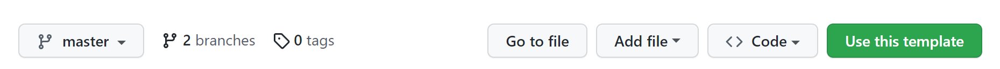
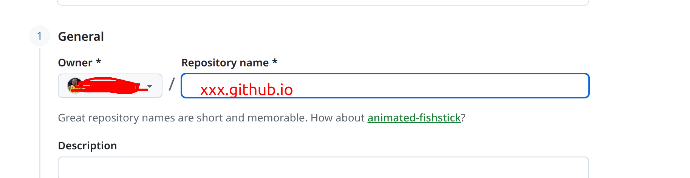
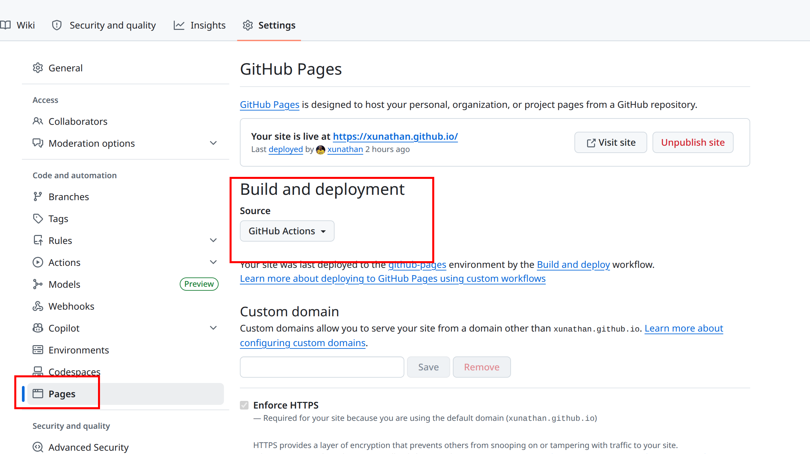
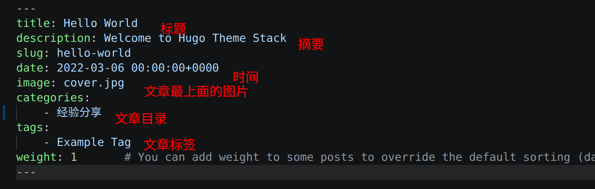
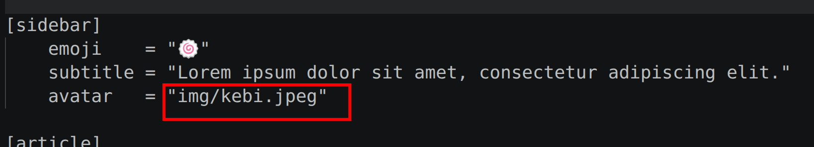

Hugo 是一个基于 Go 语言编写的静态网站生成器，被广泛认为是目前全球最快的网站构建框架之一。它的核心理念是将你用 Markdown 等格式编写的内容，快速编译成完整的、可直接部署的静态 HTML 网站。简单来说，你只需要专注于用 Markdown 写文章，Hugo 负责帮你生成一个速度快、性能高、外观漂亮的网站。

Hugo有很多主题，本文使用的为[Stack](https://github.com/CaiJimmy/hugo-theme-stack)。使用教程可参考[Hugo Theme Stack Starter](https://github.com/CaiJimmy/hugo-theme-stack-starter)。

## 使用模板创建自己的Github Pages库

### 使用模板创建仓库
hugo-theme-stack-starter中表明了可使用此库为模板创建自己的Github库，直接点击右上角的use this template。



创建的仓库名字必须是(github帐号名.github.io）这种格式的。

### 设置仓库的Pages

进入新创建的仓库，点击setting，进入设置页面，选择Pages，设置Pages使用GitHub Actions发布。等一下，看到上面的显示Deployed之后，点击Vistit Site就可以访问你的Github Pages了。


## 本地新增文章

本地新增文章需要先使用git把刚刚创建的仓库clone下来，没这部分就不赘述了。
文章都在content->post目录下。
文章使用markdown编写，可参考[Markdown教程](https://www.runoob.com/markdown/md-tutorial.html)。
博文的一些设置可放到文件头部的位置，常用的设置如下：



### 本地验证
本地验证需要安装hugo。执行如下命令就可以在浏览器验证新增的博文。

```
hugo server -D
```
执行之后然后命令行输出网址在浏览器体验。

## 博客显示设置
### 更改头像设置
在config/_default目录中，找到params.toml，参考如下图中的图片替换为自己的图像，注意图片要放到assets/img目录下。


