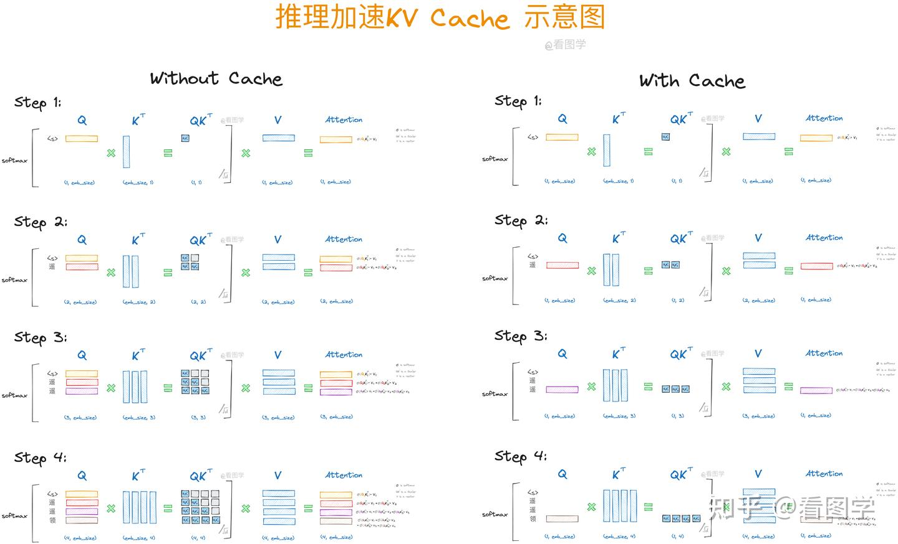

## 为什么需要KV cache
大模型推理是"一个字一个字"往外蹦的：模型根据已经生成的所有 token，预测下一个 token，然后把新 token 拼回输入，再预测下一个……如此循环。

在每一步的自注意力计算中，每个 token 都需要和它之前所有 token 计算注意力权重，核心公式是：
```
Attention(Q, K, V) = softmax(QK^T / sqrt(d)) V
```
如果不做任何缓存，每生成一个新 token，就要把从头到当前位置的所有 token 重新过一遍(重新计算出每一个attention层的所有历史 token 的 K（Key）和 V（Value）向量)。序列越长，这个重复计算的代价越大——生成第 N 个 token 时，前 N-1 个 token 的 K、V 其实和上一步算出来的完全一样，白白重算了一遍。可参考下图。

**KV Cache 的思路很简单：既然历史 token 的 K、V 不会变，那就把它们存下来，每一步只计算新 token 的 K、V，然后和缓存拼接**。这样每步只需要一次前向计算加一次小规模的注意力计算，而不是重新过一遍全部历史。这是一个经典的"用空间换时间"的策略,把生成阶段的复杂度从和序列长度的平方相关,降低到和序列长度线性相关。

### vllm推理框架kv cache的计算

上段说到kv cache可以缓存已经计算出的token的K、V向量，得到以空间换时间的效果，提高推理的速度，kv cache到底需要占用多少显存呢。
每token的kv cache计算公式如下：
```
2 (K和V) × L × H × d × 精度字节数
```
`L` 注意力层数、`H` 每层kv头数、`d` 为kv头的向量维度。
以qwen3:0.6B模型为例，在fp16/bf16精度下单token的字节数为：2 *  28 * 8 * 128 *2 = 114,688 字节 ≈ 112 KB。这个数值看着不大，但是还要乘以请求序列的长度，batch中并发的请求数，那就很大了。
在实际的推理服务中,请求的长度是不可预知的且动态变化的，这部分显存的申请和释放的管理就变得尤为重要了。

在 vLLM 出现之前,主流做法是给每个请求**预分配一块连续显存**,大小等于模型支持的最大序列长度。这样做简单,但会造成严重浪费:
- **内部碎片**:大多数请求实际生成的长度远小于预分配的最大长度,分配出去但没用上的显存就被浪费了。
- **外部碎片**:不同请求占用大小不一的连续显存块,释放之后会在显存中留下大小不一的空洞,难以被后续请求复用。
- **无法共享**:比如多个请求共享同一个系统提示词(prompt)时,传统方式没法让它们复用同一份 KV Cache,只能各自存一份。

vLLM 团队的论文里提到,这种粗放式管理方式下,显存利用率经常只有 20%~40%,大量显存被浪费而不是用来服务更多请求。

## PageAttention
vLLM 的核心创新 **PagedAttention**,思路是直接照搬操作系统虚拟内存管理里"分页"的经验:不再要求 KV Cache 必须存放在一整块连续显存里,而是把它切成固定大小的小块(block),按需分配、非连续存放。

具体设计大致如下:

**1. 分块存储(KV Block)**

每个序列的 KV Cache 被划分成多个固定大小的块,每个块能容纳固定数量(比如 16 个)token 的 K、V 向量。这些块在物理显存中可以分散在任意位置,不要求连续。

**2. 块表(Block Table)做地址映射**

每个序列维护一张"块表",记录逻辑上的第几个块对应到物理显存中的哪个位置——这和操作系统里"页表"把虚拟地址映射到物理地址是同一个思路。计算注意力时,PagedAttention 的自定义 CUDA kernel 会根据块表去物理显存里"按图索骥"地取出各个块,再做计算,对用户和上层调度逻辑而言,整个 KV Cache 看起来还是一个逻辑上连续的序列。

**3. 按需分配,消灭内部碎片**

因为是按块分配,不需要一次性预留最大长度的显存,序列生成到哪一步就分配到哪一步,只有最后一个块可能有少量未用满的空间,内部碎片被压缩到接近于一个块的大小。

**4. 物理块可以被多个逻辑序列共享**

这是分页思想带来的一个额外好处:如果多个请求共享相同的前缀(比如同一个 few-shot 提示词,或者一次并行采样的多个候选分支),它们对应的块表可以指向同一批物理块,不需要复制。vLLM 采用类似写时复制(copy-on-write)的机制——多个序列共享的块保持只读共享状态,一旦某个序列需要在共享块上写入新内容(比如生成分叉出不同的后续内容),才会真正复制一份该块,其余仍然共享。这对 beam search、并行采样、共享系统提示词等场景能显著省显存。

**5. 调度器统一管理物理块**

vLLM 有一个中心化的块管理器,像操作系统管理物理内存页一样管理这些物理块:哪些块空闲、哪些块被哪些序列占用、什么时候可以回收复用,都由它统一调度。当显存紧张时,还可以支持将部分块换出(swap)到 CPU 内存,或者直接重新计算(recompute),为更高优先级的请求腾出空间。

这套设计把 KV Cache 的显存浪费控制在很低的水平(接近于只有最后一个块的部分浪费),显存利用率能提升到接近 90% 以上。省下来的显存直接转化成了更大的 batch size，提高显卡的并发数。

## Prefix Cache

上面的章节讲 KV Cache 的原理和 vLLM 用 PagedAttention 解决显存碎片问题的思路。这次讲一个建立在 PagedAttention 之上的优化——**Automatic Prefix Caching(自动前缀缓存,简称 APC)**,它解决的是另一个很常见的浪费:同样的前缀内容,被不同请求反复计算。